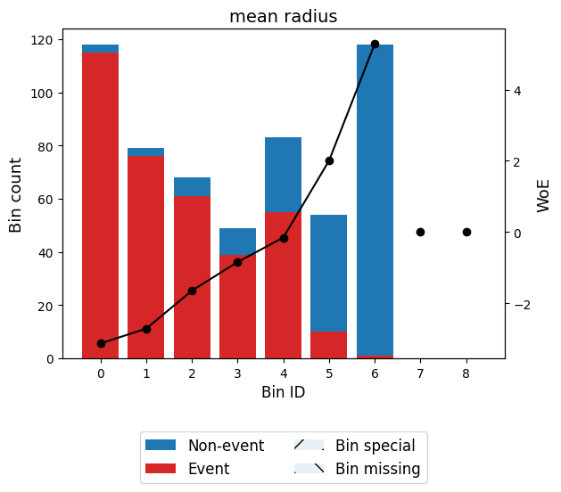

# Exercise 4. - Data Cleansing

## Handling Missing Values in Python


Real world data is messy and often contains a lot of missing values. 

There could be multiple reasons for the missing values but primarily the reason for missingness can be attributed to:

| Reason for missing Data | 
| :-----------: | 
| Data doesn't exist |
| Data not collected due to human error. | 
| Data deleted accidently |

## A guide to handling missing values 

Please read this tutorial on handling missing values first, before working on dirty data this week: [TUTORIAL](a_guide_to_na.ipynb).

# Dirty data


```python
import pandas as pd
import numpy as np
from sklearn.ensemble import RandomForestClassifier
import warnings
import ssl
# Suppress warnings
warnings.filterwarnings('ignore')
# Disable SSL verification
ssl._create_default_https_context = ssl._create_unverified_context
import requests
from io import StringIO
```

Load the dataset from the provided URL using pandas.


```python
url = "https://raw.github.com/edwindj/datacleaning/master/data/dirty_iris.csv"
response = requests.get(url, verify=False)
data = StringIO(response.text)
dirty_iris = pd.read_csv(data, sep=",")
print(dirty_iris.head())
```

       Sepal.Length  Sepal.Width  Petal.Length  Petal.Width     Species
    0           6.4          3.2           4.5          1.5  versicolor
    1           6.3          3.3           6.0          2.5   virginica
    2           6.2          NaN           5.4          2.3   virginica
    3           5.0          3.4           1.6          0.4      setosa
    4           5.7          2.6           3.5          1.0  versicolor
    

## Introduce Missing Values

Randomly introduce missing values into the dataset to mimic the Python code behavior.


```python
# Load additional data
carseats = pd.read_csv("https://raw.githubusercontent.com/selva86/datasets/master/Carseats.csv")

# Set random seed for reproducibility
np.random.seed(123)

# Introduce missing values in 'Income' column
income_missing_indices = np.random.choice(carseats.index, size=20, replace=False)
carseats.loc[income_missing_indices, 'Income'] = np.nan

# Set another random seed for reproducibility
np.random.seed(456)

# Introduce missing values in 'Urban' column
urban_missing_indices = np.random.choice(carseats.index, size=10, replace=False)
carseats.loc[urban_missing_indices, 'Urban'] = np.nan


```

# Introduction

Analysis of data is a process of inspecting, cleaning, transforming, and modeling data with the goal of highlighting useful information, suggesting conclusions and supporting decision making.


Many times in the beginning we spend hours on handling problems with missing values, logical inconsistencies or outliers in our datasets. In this tutorial we will go through the most popular techniques in data cleansing.


We will be working with the messy dataset `iris`. Originally published at UCI Machine Learning Repository: Iris Data Set, this small dataset from 1936 is often used for testing out machine learning algorithms and visualizations. Each row of the table represents an iris flower, including its species and dimensions of its botanical parts, sepal and petal, in centimeters.

Take a look at this dataset here:


```python
dirty_iris
```


<div>
<style scoped>
    .dataframe tbody tr th:only-of-type {
        vertical-align: middle;
    }

    .dataframe tbody tr th {
        vertical-align: top;
    }

    .dataframe thead th {
        text-align: right;
    }
</style>
<table border="1" class="dataframe">
  <thead>
    <tr style="text-align: right;">
      <th></th>
      <th>Sepal.Length</th>
      <th>Sepal.Width</th>
      <th>Petal.Length</th>
      <th>Petal.Width</th>
      <th>Species</th>
    </tr>
  </thead>
  <tbody>
    <tr>
      <th>0</th>
      <td>6.4</td>
      <td>3.2</td>
      <td>4.5</td>
      <td>1.5</td>
      <td>versicolor</td>
    </tr>
    <tr>
      <th>1</th>
      <td>6.3</td>
      <td>3.3</td>
      <td>6.0</td>
      <td>2.5</td>
      <td>virginica</td>
    </tr>
    <tr>
      <th>2</th>
      <td>6.2</td>
      <td>NaN</td>
      <td>5.4</td>
      <td>2.3</td>
      <td>virginica</td>
    </tr>
    <tr>
      <th>3</th>
      <td>5.0</td>
      <td>3.4</td>
      <td>1.6</td>
      <td>0.4</td>
      <td>setosa</td>
    </tr>
    <tr>
      <th>4</th>
      <td>5.7</td>
      <td>2.6</td>
      <td>3.5</td>
      <td>1.0</td>
      <td>versicolor</td>
    </tr>
    <tr>
      <th>...</th>
      <td>...</td>
      <td>...</td>
      <td>...</td>
      <td>...</td>
      <td>...</td>
    </tr>
    <tr>
      <th>145</th>
      <td>6.7</td>
      <td>3.1</td>
      <td>5.6</td>
      <td>2.4</td>
      <td>virginica</td>
    </tr>
    <tr>
      <th>146</th>
      <td>5.6</td>
      <td>3.0</td>
      <td>4.5</td>
      <td>1.5</td>
      <td>versicolor</td>
    </tr>
    <tr>
      <th>147</th>
      <td>5.2</td>
      <td>3.5</td>
      <td>1.5</td>
      <td>0.2</td>
      <td>setosa</td>
    </tr>
    <tr>
      <th>148</th>
      <td>6.4</td>
      <td>3.1</td>
      <td>NaN</td>
      <td>1.8</td>
      <td>virginica</td>
    </tr>
    <tr>
      <th>149</th>
      <td>5.8</td>
      <td>2.6</td>
      <td>4.0</td>
      <td>NaN</td>
      <td>versicolor</td>
    </tr>
  </tbody>
</table>
<p>150 rows × 5 columns</p>
</div>


## Detecting NA

A missing value, represented by NaN in Python, is a placeholder for a datum of which the type is known but its value isn't. Therefore, it is impossible to perform statistical analysis on data where one or more values in the data are missing. One may choose to either omit elements from a dataset that contain missing values or to impute a value, but missingness is something to be dealt with prior to any analysis.


Can you see that many values in our dataset have status NaN = Not Available? Count (or plot), how many (%) of all 150 rows is complete.


```python
# Count the number of complete cases (rows without any missing values)
complete_cases = dirty_iris.dropna().shape[0]

# Calculate the percentage of complete cases
percentage_complete = (complete_cases / dirty_iris.shape[0]) * 100

print(f"Number of complete cases: {complete_cases}")
print(f"Percentage of complete cases: {percentage_complete:.2f}%")
```

    Number of complete cases: 96
    Percentage of complete cases: 64.00%
    

Does the data contain other special values? If it does, replace them with NA.


```python
# Define a function to check for special values
def is_special(x):
    if np.issubdtype(x.dtype, np.number):
        return ~np.isfinite(x)
    else:
        return pd.isna(x)

# Apply the function to each column and replace special values with NaN
for col in dirty_iris.columns:
    dirty_iris[col] = dirty_iris[col].apply(lambda x: np.nan if is_special(pd.Series([x]))[0] else x)

# Display summary of the data
print(dirty_iris.describe(include='all'))
```

            Sepal.Length  Sepal.Width  Petal.Length  Petal.Width     Species
    count     140.000000   133.000000    131.000000   137.000000         150
    unique           NaN          NaN           NaN          NaN           3
    top              NaN          NaN           NaN          NaN  versicolor
    freq             NaN          NaN           NaN          NaN          50
    mean        6.559286     3.390977      4.449962     1.207299         NaN
    std         6.800940     3.315310      5.769299     0.764722         NaN
    min         0.000000    -3.000000      0.000000     0.100000         NaN
    25%         5.100000     2.800000      1.600000     0.300000         NaN
    50%         5.750000     3.000000      4.500000     1.300000         NaN
    75%         6.400000     3.300000      5.100000     1.800000         NaN
    max        73.000000    30.000000     63.000000     2.500000         NaN
    

## Checking consistency

Consistent data are technically correct data that are fit for statistical analysis. They are data in which missing values, special values, (obvious) errors and outliers are either removed, corrected or imputed. The data are consistent with constraints based on real-world knowledge about the subject that the data describe.


We have the following background knowledge:

-   Species should be one of the following values: setosa, versicolor or virginica.

-   All measured numerical properties of an iris should be positive.

-   The petal length of an iris is at least 2 times its petal width.

-   The sepal length of an iris cannot exceed 30 cm.

-   The sepals of an iris are longer than its petals.

Define these rules in a separate object 'RULES' and read them into Python. Print the resulting constraint object.


```python
# Define the rules as functions
def check_rules(df):
    rules = {
        "Sepal.Length <= 30": df["Sepal.Length"] <= 30,
        "Species in ['setosa', 'versicolor', 'virginica']": df["Species"].isin(['setosa', 'versicolor', 'virginica']),
        "Sepal.Length > 0": df["Sepal.Length"] > 0,
        "Sepal.Width > 0": df["Sepal.Width"] > 0,
        "Petal.Length > 0": df["Petal.Length"] > 0,
        "Petal.Width > 0": df["Petal.Width"] > 0,
        "Petal.Length >= 2 * Petal.Width": df["Petal.Length"] >= 2 * df["Petal.Width"],
        "Sepal.Length > Petal.Length": df["Sepal.Length"] > df["Petal.Length"]
    }
    return rules

# Apply the rules to the dataframe
rules = check_rules(dirty_iris)

# Print the rules
for rule, result in rules.items():
    print(f"{rule}: {result.all()}")
```

    Sepal.Length <= 30: False
    Species in ['setosa', 'versicolor', 'virginica']: True
    Sepal.Length > 0: False
    Sepal.Width > 0: False
    Petal.Length > 0: False
    Petal.Width > 0: False
    Petal.Length >= 2 * Petal.Width: False
    Sepal.Length > Petal.Length: False
    

Now we are ready to determine how often each rule is broken (violations). Also we can summarize and plot the result.


```python
# Check for rule violations
violations = {rule: ~result for rule, result in rules.items()}

# Summarize the violations
summary = {rule: result.sum() for rule, result in violations.items()}

# Print the summary of violations
print("Summary of Violations:")
for rule, count in summary.items():
    print(f"{rule}: {count} violations")
```

    Summary of Violations:
    Sepal.Length <= 30: 12 violations
    Species in ['setosa', 'versicolor', 'virginica']: 0 violations
    Sepal.Length > 0: 11 violations
    Sepal.Width > 0: 19 violations
    Petal.Length > 0: 20 violations
    Petal.Width > 0: 13 violations
    Petal.Length >= 2 * Petal.Width: 34 violations
    Sepal.Length > Petal.Length: 30 violations
    

What percentage of the data has no errors?


```python
import matplotlib.pyplot as plt
# Plot the violations
violation_counts = pd.Series(summary)
ax = violation_counts.plot(kind='bar', figsize=(10, 6))
plt.title('Summary of Rule Violations')
plt.xlabel('Rules')
plt.ylabel('Number of Violations')

# Add percentage labels above the bars
for p in ax.patches:
    ax.annotate(f'{p.get_height() / len(dirty_iris) * 100:.1f}%', 
                (p.get_x() + p.get_width() / 2., p.get_height()), 
                ha='center', va='center', xytext=(0, 10), 
                textcoords='offset points')

plt.show()
```


    

    


```python
import missingno as msno
msno.bar(dirty_iris, figsize=(10,6))
msno.matrix(dirty_iris, figsize=(10,6))
msno.heatmap(dirty_iris, figsize=(10,6))
msno.dendrogram(dirty_iris, figsize=(10,6))
```


    <Axes: >


    

    


    

    


    

    


    

    


Find out which observations have too long sepals using the result of violations.


```python
# Check for rule violations
violations = {rule: ~result for rule, result in rules.items()}
# Combine violations into a DataFrame
violated_df = pd.DataFrame(violations)
violated_rows = dirty_iris[violated_df["Sepal.Length <= 30"]]
print(violated_rows)
```

         Sepal.Length  Sepal.Width  Petal.Length  Petal.Width     Species
    14            NaN          3.9          1.70          0.4      setosa
    18            NaN          4.0           NaN          0.2      setosa
    24            NaN          3.0          5.90          2.1   virginica
    27           73.0         29.0         63.00          NaN   virginica
    29            NaN          2.8          0.82          1.3  versicolor
    57            NaN          2.9          4.50          1.5  versicolor
    67            NaN          3.2          5.70          2.3   virginica
    113           NaN          3.3          5.70          2.1   virginica
    118           NaN          3.0          5.50          2.1   virginica
    119           NaN          2.8          4.70          1.2  versicolor
    124          49.0         30.0         14.00          2.0      setosa
    137           NaN          3.0          4.90          1.8   virginica
    

Find outliers in sepal length using boxplot approach. Retrieve the corresponding observations and look at the other values. Any ideas what might have happened? Set the outliers to NA (or a value that you find more appropiate)


```python
# Boxplot for Sepal.Length
plt.figure(figsize=(10, 6))
plt.boxplot(dirty_iris['Sepal.Length'].dropna())
plt.title('Boxplot of Sepal Length')
plt.ylabel('Sepal Length')
plt.show()
```


    

    


```python
# Find outliers in Sepal.Length
outliers = dirty_iris['Sepal.Length'][np.abs(dirty_iris['Sepal.Length'] - dirty_iris['Sepal.Length'].mean()) > (1.5 * dirty_iris['Sepal.Length'].std())]
outliers_idx = dirty_iris.index[dirty_iris['Sepal.Length'].isin(outliers)]

# Print the rows with outliers
print("Outliers:")
print(dirty_iris.loc[outliers_idx])
```

    Outliers:
         Sepal.Length  Sepal.Width  Petal.Length  Petal.Width    Species
    27           73.0         29.0          63.0          NaN  virginica
    124          49.0         30.0          14.0          2.0     setosa
    

They all seem to be too big... may they were measured in mm i.o cm?


```python
# Adjust the outliers (assuming they were measured in mm instead of cm)
dirty_iris.loc[outliers_idx, ['Sepal.Length', 'Sepal.Width', 'Petal.Length', 'Petal.Width']] /= 10

# Summary of the adjusted data
print("Summary of adjusted data:")
print(dirty_iris.describe())
```

    Summary of adjusted data:
           Sepal.Length  Sepal.Width  Petal.Length  Petal.Width
    count    140.000000   133.000000    131.000000   137.000000
    mean       5.775000     2.991729      3.920954     1.194161
    std        0.969842     0.708075      2.455417     0.766463
    min        0.000000    -3.000000      0.000000     0.100000
    25%        5.100000     2.800000      1.600000     0.300000
    50%        5.700000     3.000000      4.400000     1.300000
    75%        6.400000     3.300000      5.100000     1.800000
    max        7.900000     4.200000     23.000000     2.500000
    


Note that simple boxplot shows an extra outlier!


```python
import seaborn as sns
plt.figure(figsize=(10, 6))
sns.boxplot(x='Species', y='Sepal.Length', data=dirty_iris)
plt.title('Boxplot of Sepal Length by Species')
plt.xlabel('Species')
plt.ylabel('Sepal Length')
plt.show()
```


    

    


## Correcting

Replace non positive values from Sepal.Width with NA:


```python
# Define the correction rule
def correct_sepal_width(df):
    df.loc[(~df['Sepal.Width'].isna()) & (df['Sepal.Width'] <= 0), 'Sepal.Width'] = np.nan
    return df

# Apply the correction rule to the dataframe
mydata_corrected = correct_sepal_width(dirty_iris)

# Print the corrected dataframe
print(mydata_corrected)
```

         Sepal.Length  Sepal.Width  Petal.Length  Petal.Width     Species
    0             6.4          3.2           4.5          1.5  versicolor
    1             6.3          3.3           6.0          2.5   virginica
    2             6.2          NaN           5.4          2.3   virginica
    3             5.0          3.4           1.6          0.4      setosa
    4             5.7          2.6           3.5          1.0  versicolor
    ..            ...          ...           ...          ...         ...
    145           6.7          3.1           5.6          2.4   virginica
    146           5.6          3.0           4.5          1.5  versicolor
    147           5.2          3.5           1.5          0.2      setosa
    148           6.4          3.1           NaN          1.8   virginica
    149           5.8          2.6           4.0          NaN  versicolor
    
    [150 rows x 5 columns]
    

Replace all erroneous values with NA using (the result of) localizeErrors:


```python
# Apply the rules to the dataframe
rules = check_rules(dirty_iris)
violations = {rule: ~result for rule, result in rules.items()}
violated_df = pd.DataFrame(violations)

# Localize errors and set them to NA
for col in violated_df.columns:
    dirty_iris.loc[violated_df[col], col.split()[0]] = np.nan
```

## Imputing NA's

Imputation is the process of estimating or deriving values for fields where data is missing. There is a vast body of literature on imputation methods and it goes beyond the scope of this tutorial to discuss all of them.

There is no one single best imputation method that works in all cases. The imputation model of choice depends on what auxiliary information is available and whether there are (multivariate) edit restrictions on the data to be imputed. The availability of R software for imputation under edit restrictions is, to our best knowledge, limited. However, a viable strategy for imputing numerical data is to first impute missing values without restrictions, and then minimally adjust the imputed values so that the restrictions are obeyed. Separately, these methods are available in R.

We can mention several approaches to imputation:

1.  For the **quantitative** variables:

-   imputing by **mean**/**median**/**mode**

-   **KNN** -- K-nearest-neighbors approach

-   **RPART** -- random forests multivariate approach

-   **mice** - Multivariate Imputation by Chained Equations approach

2.  For the **qualitative** variables:

-   imputing by **mode**

-   **RPART** -- random forests multivariate approach

-   **mice** - Multivariate Imputation by Chained Equations approach

    ... and many others. Please read the theoretical background if you are interested in those techniques.


***Exercise 1.*** Use ***kNN*** imputation ('sklearn' package) to impute all missing values. The KNNImputer from sklearn requires all data to be numeric. Since our dataset contains categorical data (e.g., the Species column), you need to handle these columns separately. One approach is to use one-hot encoding for categorical variables before applying the imputer.


```python
from sklearn.impute import KNNImputer
from sklearn.preprocessing import OneHotEncoder
# Replace infinite values with NaN
dirty_iris.replace([np.inf, -np.inf], np.nan, inplace=True)

# Separate numeric and categorical columns
numeric_cols = dirty_iris.select_dtypes(include=[np.number]).columns
categorical_cols = dirty_iris.select_dtypes(exclude=[np.number]).columns
# One-hot encode categorical columns
encoder = OneHotEncoder(sparse_output=False, handle_unknown='ignore')

encoded_categorical = pd.DataFrame(encoder.fit_transform(dirty_iris[categorical_cols]), columns=encoder.get_feature_names_out(categorical_cols))

# Combine numeric and encoded categorical columns
combined_data = pd.concat([dirty_iris[numeric_cols], encoded_categorical], axis=1)

# Initialize the KNNImputer
imputer = KNNImputer(n_neighbors=3)

# Perform kNN imputation
imputed_data = imputer.fit_transform(combined_data)

# Convert the imputed data back to a DataFrame
imputed_df = pd.DataFrame(imputed_data, columns=combined_data.columns)

# Decode the one-hot encoded columns back to original categorical columns
decoded_categorical = pd.DataFrame(encoder.inverse_transform(imputed_df[encoded_categorical.columns]), columns=categorical_cols)

# Combine numeric and decoded categorical columns
final_imputed_data = pd.concat([imputed_df[numeric_cols], decoded_categorical], axis=1)

# Print the imputed data
print(final_imputed_data)
```

         Sepal.Length  Sepal.Width  Petal.Length  Petal.Width     Species
    0        6.400000     3.200000      4.500000     1.500000  versicolor
    1        6.300000     3.300000      6.000000     2.500000   virginica
    2        6.200000     3.033333      5.400000     2.300000   virginica
    3        5.000000     3.400000      1.600000     0.400000      setosa
    4        5.700000     2.600000      3.500000     1.000000  versicolor
    ..            ...          ...           ...          ...         ...
    145      6.700000     3.100000      5.600000     2.400000   virginica
    146      5.600000     3.000000      4.500000     1.500000  versicolor
    147      5.200000     3.500000      1.500000     0.200000      setosa
    148      6.533333     3.100000      5.166667     1.800000   virginica
    149      5.800000     2.600000      3.833333     1.066667  versicolor
    
    [150 rows x 5 columns]
    

## Transformations

Finally, we sometimes encounter the situation where we have problems with skewed distributions or we just want to transform, recode or perform discretization. Let's review some of the most popular transformation methods.

First, standardization (also known as normalization):

-   **Z-score** approach - standardization procedure, using the formula: $z=\frac{x-\mu}{\sigma}$ where $\mu$ = mean and $\sigma$ = standard deviation. Z-scores are also known as standardized scores; they are scores (or data values) that have been given a common *standard*. This standard is a mean of zero and a standard deviation of 1.

-   **minmax** approach - An alternative approach to Z-score normalization (or standardization) is the so-called MinMax scaling (often also simply called "normalization" - a common cause for ambiguities). In this approach, the data is scaled to a fixed range - usually 0 to 1. The cost of having this bounded range - in contrast to standardization - is that we will end up with smaller standard deviations, which can suppress the effect of outliers. If you would like to perform MinMax scaling - simply substract minimum value and divide it by range:$(x-min)/(max-min)$

In order to solve problems with very skewed distributions we can also use several types of simple transformations:

-   log
-   log+1
-   sqrt
-   x\^2
-   x\^3

***Exercise 2.*** Standardize incomes and present the transformed distribution of incomes on boxplot.


```python
mean_incomes = carseats['Income'].mean()
std_incomes = carseats['Income'].std()

carseats['StandarizedIncome'] = (carseats['Income'] - mean_incomes) / std_incomes

plt.figure(figsize=(6, 4))
sns.boxplot(data=carseats, y='StandarizedIncome')
plt.title('Boxplot of Standardized Income')
plt.ylabel('Standardized Income')
plt.show()
```


    

    


## Binning

Sometimes we just would like to perform so called 'binning' procedure to be able to analyze our categorical data, to compare several categorical variables, to construct statistical models etc. Thanks to the 'binning' function we can transform quantitative variables into categorical using several methods:

-   **quantile** - automatic binning by quantile of its distribution

-   **equal** - binning to achieve fixed length of intervals

-   **pretty** - a compromise between the 2 mentioned above

-   **kmeans** - categorization using the K-Means algorithm

-   **bclust** - categorization using the bagged clustering algorithm

**Exercise 3.** Using quantile approach perform binning of the variable 'Income'.


```python
carseats['Income_bin'] = pd.qcut(carseats['Income'], q=4, labels=['Low', 'Mid-Low', 'Mid-High', 'High'])

carseats[['Income', 'Income_bin']]
```


<div>
<style scoped>
    .dataframe tbody tr th:only-of-type {
        vertical-align: middle;
    }

    .dataframe tbody tr th {
        vertical-align: top;
    }

    .dataframe thead th {
        text-align: right;
    }
</style>
<table border="1" class="dataframe">
  <thead>
    <tr style="text-align: right;">
      <th></th>
      <th>Income</th>
      <th>Income_bin</th>
    </tr>
  </thead>
  <tbody>
    <tr>
      <th>0</th>
      <td>73.0</td>
      <td>Mid-High</td>
    </tr>
    <tr>
      <th>1</th>
      <td>48.0</td>
      <td>Mid-Low</td>
    </tr>
    <tr>
      <th>2</th>
      <td>35.0</td>
      <td>Low</td>
    </tr>
    <tr>
      <th>3</th>
      <td>100.0</td>
      <td>High</td>
    </tr>
    <tr>
      <th>4</th>
      <td>64.0</td>
      <td>Mid-Low</td>
    </tr>
    <tr>
      <th>...</th>
      <td>...</td>
      <td>...</td>
    </tr>
    <tr>
      <th>395</th>
      <td>108.0</td>
      <td>High</td>
    </tr>
    <tr>
      <th>396</th>
      <td>23.0</td>
      <td>Low</td>
    </tr>
    <tr>
      <th>397</th>
      <td>26.0</td>
      <td>Low</td>
    </tr>
    <tr>
      <th>398</th>
      <td>79.0</td>
      <td>Mid-High</td>
    </tr>
    <tr>
      <th>399</th>
      <td>37.0</td>
      <td>Low</td>
    </tr>
  </tbody>
</table>
<p>400 rows × 2 columns</p>
</div>


**Exercise 4.** Recode the original distribution of incomes using fixed length of intervals and assign them labels.


```python
# Equal
carseats['Income_bin_equal'] = pd.cut(carseats['Income'], bins=3, labels=['Low', 'Mid', 'High'])

carseats[['Income', 'Income_bin_equal']]

```


<div>
<style scoped>
    .dataframe tbody tr th:only-of-type {
        vertical-align: middle;
    }

    .dataframe tbody tr th {
        vertical-align: top;
    }

    .dataframe thead th {
        text-align: right;
    }
</style>
<table border="1" class="dataframe">
  <thead>
    <tr style="text-align: right;">
      <th></th>
      <th>Income</th>
      <th>Income_bin_equal</th>
    </tr>
  </thead>
  <tbody>
    <tr>
      <th>0</th>
      <td>73.0</td>
      <td>Mid</td>
    </tr>
    <tr>
      <th>1</th>
      <td>48.0</td>
      <td>Low</td>
    </tr>
    <tr>
      <th>2</th>
      <td>35.0</td>
      <td>Low</td>
    </tr>
    <tr>
      <th>3</th>
      <td>100.0</td>
      <td>High</td>
    </tr>
    <tr>
      <th>4</th>
      <td>64.0</td>
      <td>Mid</td>
    </tr>
    <tr>
      <th>...</th>
      <td>...</td>
      <td>...</td>
    </tr>
    <tr>
      <th>395</th>
      <td>108.0</td>
      <td>High</td>
    </tr>
    <tr>
      <th>396</th>
      <td>23.0</td>
      <td>Low</td>
    </tr>
    <tr>
      <th>397</th>
      <td>26.0</td>
      <td>Low</td>
    </tr>
    <tr>
      <th>398</th>
      <td>79.0</td>
      <td>Mid</td>
    </tr>
    <tr>
      <th>399</th>
      <td>37.0</td>
      <td>Low</td>
    </tr>
  </tbody>
</table>
<p>400 rows × 2 columns</p>
</div>


In case of statistical modeling (i.e. credit scoring purposes) - we need to be aware of the fact, that the ***optimal*** discretization of the original distribution must be achieved. The '*binning_by*' function comes with some help here.

## Optimal binning with binary target

**Exercise 5.** Perform discretization of the variable 'Advertising' using optimal binning.


```python
from optbinning import OptimalBinning
from sklearn.datasets import load_breast_cancer

data = load_breast_cancer()
df = pd.DataFrame(data.data, columns=data.feature_names)
```

    load c:\Users\robert\AppData\Local\Programs\Python\Python313\Lib\site-packages\ortools\.libs\zlib1.dll...
    load c:\Users\robert\AppData\Local\Programs\Python\Python313\Lib\site-packages\ortools\.libs\abseil_dll.dll...
    load c:\Users\robert\AppData\Local\Programs\Python\Python313\Lib\site-packages\ortools\.libs\utf8_validity.dll...
    load c:\Users\robert\AppData\Local\Programs\Python\Python313\Lib\site-packages\ortools\.libs\re2.dll...
    load c:\Users\robert\AppData\Local\Programs\Python\Python313\Lib\site-packages\ortools\.libs\libprotobuf.dll...
    load c:\Users\robert\AppData\Local\Programs\Python\Python313\Lib\site-packages\ortools\.libs\highs.dll...
    load c:\Users\robert\AppData\Local\Programs\Python\Python313\Lib\site-packages\ortools\.libs\ortools.dll...
    (CVXPY) Apr 13 09:22:46 PM: Encountered unexpected exception importing solver GLOP:
    RuntimeError('Unrecognized new version of ortools (9.12.4544). Expected < 9.12.0. Please open a feature request on cvxpy to enable support for this version.')
    (CVXPY) Apr 13 09:22:46 PM: Encountered unexpected exception importing solver PDLP:
    RuntimeError('Unrecognized new version of ortools (9.12.4544). Expected < 9.12.0. Please open a feature request on cvxpy to enable support for this version.')
    

We choose a variable to discretize and the binary target.


```python
variable = "mean radius"
x = df[variable].values
y = data.target
```

Import and instantiate an OptimalBinning object class. We pass the variable name, its data type, and a solver, in this case, we choose the constraint programming solver.


```python
optb = OptimalBinning(name=variable, dtype="numerical", solver="cp")
```

We fit the optimal binning object with arrays x and y.


```python
optb.fit(x, y)
```


<style>#sk-container-id-1 {
  /* Definition of color scheme common for light and dark mode */
  --sklearn-color-text: #000;
  --sklearn-color-text-muted: #666;
  --sklearn-color-line: gray;
  /* Definition of color scheme for unfitted estimators */
  --sklearn-color-unfitted-level-0: #fff5e6;
  --sklearn-color-unfitted-level-1: #f6e4d2;
  --sklearn-color-unfitted-level-2: #ffe0b3;
  --sklearn-color-unfitted-level-3: chocolate;
  /* Definition of color scheme for fitted estimators */
  --sklearn-color-fitted-level-0: #f0f8ff;
  --sklearn-color-fitted-level-1: #d4ebff;
  --sklearn-color-fitted-level-2: #b3dbfd;
  --sklearn-color-fitted-level-3: cornflowerblue;

  /* Specific color for light theme */
  --sklearn-color-text-on-default-background: var(--sg-text-color, var(--theme-code-foreground, var(--jp-content-font-color1, black)));
  --sklearn-color-background: var(--sg-background-color, var(--theme-background, var(--jp-layout-color0, white)));
  --sklearn-color-border-box: var(--sg-text-color, var(--theme-code-foreground, var(--jp-content-font-color1, black)));
  --sklearn-color-icon: #696969;

  @media (prefers-color-scheme: dark) {
    /* Redefinition of color scheme for dark theme */
    --sklearn-color-text-on-default-background: var(--sg-text-color, var(--theme-code-foreground, var(--jp-content-font-color1, white)));
    --sklearn-color-background: var(--sg-background-color, var(--theme-background, var(--jp-layout-color0, #111)));
    --sklearn-color-border-box: var(--sg-text-color, var(--theme-code-foreground, var(--jp-content-font-color1, white)));
    --sklearn-color-icon: #878787;
  }
}

#sk-container-id-1 {
  color: var(--sklearn-color-text);
}

#sk-container-id-1 pre {
  padding: 0;
}

#sk-container-id-1 input.sk-hidden--visually {
  border: 0;
  clip: rect(1px 1px 1px 1px);
  clip: rect(1px, 1px, 1px, 1px);
  height: 1px;
  margin: -1px;
  overflow: hidden;
  padding: 0;
  position: absolute;
  width: 1px;
}

#sk-container-id-1 div.sk-dashed-wrapped {
  border: 1px dashed var(--sklearn-color-line);
  margin: 0 0.4em 0.5em 0.4em;
  box-sizing: border-box;
  padding-bottom: 0.4em;
  background-color: var(--sklearn-color-background);
}

#sk-container-id-1 div.sk-container {
  /* jupyter's `normalize.less` sets `[hidden] { display: none; }`
     but bootstrap.min.css set `[hidden] { display: none !important; }`
     so we also need the `!important` here to be able to override the
     default hidden behavior on the sphinx rendered scikit-learn.org.
     See: https://github.com/scikit-learn/scikit-learn/issues/21755 */
  display: inline-block !important;
  position: relative;
}

#sk-container-id-1 div.sk-text-repr-fallback {
  display: none;
}

div.sk-parallel-item,
div.sk-serial,
div.sk-item {
  /* draw centered vertical line to link estimators */
  background-image: linear-gradient(var(--sklearn-color-text-on-default-background), var(--sklearn-color-text-on-default-background));
  background-size: 2px 100%;
  background-repeat: no-repeat;
  background-position: center center;
}

/* Parallel-specific style estimator block */

#sk-container-id-1 div.sk-parallel-item::after {
  content: "";
  width: 100%;
  border-bottom: 2px solid var(--sklearn-color-text-on-default-background);
  flex-grow: 1;
}

#sk-container-id-1 div.sk-parallel {
  display: flex;
  align-items: stretch;
  justify-content: center;
  background-color: var(--sklearn-color-background);
  position: relative;
}

#sk-container-id-1 div.sk-parallel-item {
  display: flex;
  flex-direction: column;
}

#sk-container-id-1 div.sk-parallel-item:first-child::after {
  align-self: flex-end;
  width: 50%;
}

#sk-container-id-1 div.sk-parallel-item:last-child::after {
  align-self: flex-start;
  width: 50%;
}

#sk-container-id-1 div.sk-parallel-item:only-child::after {
  width: 0;
}

/* Serial-specific style estimator block */

#sk-container-id-1 div.sk-serial {
  display: flex;
  flex-direction: column;
  align-items: center;
  background-color: var(--sklearn-color-background);
  padding-right: 1em;
  padding-left: 1em;
}


/* Toggleable style: style used for estimator/Pipeline/ColumnTransformer box that is
clickable and can be expanded/collapsed.
- Pipeline and ColumnTransformer use this feature and define the default style
- Estimators will overwrite some part of the style using the `sk-estimator` class
*/

/* Pipeline and ColumnTransformer style (default) */

#sk-container-id-1 div.sk-toggleable {
  /* Default theme specific background. It is overwritten whether we have a
  specific estimator or a Pipeline/ColumnTransformer */
  background-color: var(--sklearn-color-background);
}

/* Toggleable label */
#sk-container-id-1 label.sk-toggleable__label {
  cursor: pointer;
  display: flex;
  width: 100%;
  margin-bottom: 0;
  padding: 0.5em;
  box-sizing: border-box;
  text-align: center;
  align-items: start;
  justify-content: space-between;
  gap: 0.5em;
}

#sk-container-id-1 label.sk-toggleable__label .caption {
  font-size: 0.6rem;
  font-weight: lighter;
  color: var(--sklearn-color-text-muted);
}

#sk-container-id-1 label.sk-toggleable__label-arrow:before {
  /* Arrow on the left of the label */
  content: "▸";
  float: left;
  margin-right: 0.25em;
  color: var(--sklearn-color-icon);
}

#sk-container-id-1 label.sk-toggleable__label-arrow:hover:before {
  color: var(--sklearn-color-text);
}

/* Toggleable content - dropdown */

#sk-container-id-1 div.sk-toggleable__content {
  max-height: 0;
  max-width: 0;
  overflow: hidden;
  text-align: left;
  /* unfitted */
  background-color: var(--sklearn-color-unfitted-level-0);
}

#sk-container-id-1 div.sk-toggleable__content.fitted {
  /* fitted */
  background-color: var(--sklearn-color-fitted-level-0);
}

#sk-container-id-1 div.sk-toggleable__content pre {
  margin: 0.2em;
  border-radius: 0.25em;
  color: var(--sklearn-color-text);
  /* unfitted */
  background-color: var(--sklearn-color-unfitted-level-0);
}

#sk-container-id-1 div.sk-toggleable__content.fitted pre {
  /* unfitted */
  background-color: var(--sklearn-color-fitted-level-0);
}

#sk-container-id-1 input.sk-toggleable__control:checked~div.sk-toggleable__content {
  /* Expand drop-down */
  max-height: 200px;
  max-width: 100%;
  overflow: auto;
}

#sk-container-id-1 input.sk-toggleable__control:checked~label.sk-toggleable__label-arrow:before {
  content: "▾";
}

/* Pipeline/ColumnTransformer-specific style */

#sk-container-id-1 div.sk-label input.sk-toggleable__control:checked~label.sk-toggleable__label {
  color: var(--sklearn-color-text);
  background-color: var(--sklearn-color-unfitted-level-2);
}

#sk-container-id-1 div.sk-label.fitted input.sk-toggleable__control:checked~label.sk-toggleable__label {
  background-color: var(--sklearn-color-fitted-level-2);
}

/* Estimator-specific style */

/* Colorize estimator box */
#sk-container-id-1 div.sk-estimator input.sk-toggleable__control:checked~label.sk-toggleable__label {
  /* unfitted */
  background-color: var(--sklearn-color-unfitted-level-2);
}

#sk-container-id-1 div.sk-estimator.fitted input.sk-toggleable__control:checked~label.sk-toggleable__label {
  /* fitted */
  background-color: var(--sklearn-color-fitted-level-2);
}

#sk-container-id-1 div.sk-label label.sk-toggleable__label,
#sk-container-id-1 div.sk-label label {
  /* The background is the default theme color */
  color: var(--sklearn-color-text-on-default-background);
}

/* On hover, darken the color of the background */
#sk-container-id-1 div.sk-label:hover label.sk-toggleable__label {
  color: var(--sklearn-color-text);
  background-color: var(--sklearn-color-unfitted-level-2);
}

/* Label box, darken color on hover, fitted */
#sk-container-id-1 div.sk-label.fitted:hover label.sk-toggleable__label.fitted {
  color: var(--sklearn-color-text);
  background-color: var(--sklearn-color-fitted-level-2);
}

/* Estimator label */

#sk-container-id-1 div.sk-label label {
  font-family: monospace;
  font-weight: bold;
  display: inline-block;
  line-height: 1.2em;
}

#sk-container-id-1 div.sk-label-container {
  text-align: center;
}

/* Estimator-specific */
#sk-container-id-1 div.sk-estimator {
  font-family: monospace;
  border: 1px dotted var(--sklearn-color-border-box);
  border-radius: 0.25em;
  box-sizing: border-box;
  margin-bottom: 0.5em;
  /* unfitted */
  background-color: var(--sklearn-color-unfitted-level-0);
}

#sk-container-id-1 div.sk-estimator.fitted {
  /* fitted */
  background-color: var(--sklearn-color-fitted-level-0);
}

/* on hover */
#sk-container-id-1 div.sk-estimator:hover {
  /* unfitted */
  background-color: var(--sklearn-color-unfitted-level-2);
}

#sk-container-id-1 div.sk-estimator.fitted:hover {
  /* fitted */
  background-color: var(--sklearn-color-fitted-level-2);
}

/* Specification for estimator info (e.g. "i" and "?") */

/* Common style for "i" and "?" */

.sk-estimator-doc-link,
a:link.sk-estimator-doc-link,
a:visited.sk-estimator-doc-link {
  float: right;
  font-size: smaller;
  line-height: 1em;
  font-family: monospace;
  background-color: var(--sklearn-color-background);
  border-radius: 1em;
  height: 1em;
  width: 1em;
  text-decoration: none !important;
  margin-left: 0.5em;
  text-align: center;
  /* unfitted */
  border: var(--sklearn-color-unfitted-level-1) 1pt solid;
  color: var(--sklearn-color-unfitted-level-1);
}

.sk-estimator-doc-link.fitted,
a:link.sk-estimator-doc-link.fitted,
a:visited.sk-estimator-doc-link.fitted {
  /* fitted */
  border: var(--sklearn-color-fitted-level-1) 1pt solid;
  color: var(--sklearn-color-fitted-level-1);
}

/* On hover */
div.sk-estimator:hover .sk-estimator-doc-link:hover,
.sk-estimator-doc-link:hover,
div.sk-label-container:hover .sk-estimator-doc-link:hover,
.sk-estimator-doc-link:hover {
  /* unfitted */
  background-color: var(--sklearn-color-unfitted-level-3);
  color: var(--sklearn-color-background);
  text-decoration: none;
}

div.sk-estimator.fitted:hover .sk-estimator-doc-link.fitted:hover,
.sk-estimator-doc-link.fitted:hover,
div.sk-label-container:hover .sk-estimator-doc-link.fitted:hover,
.sk-estimator-doc-link.fitted:hover {
  /* fitted */
  background-color: var(--sklearn-color-fitted-level-3);
  color: var(--sklearn-color-background);
  text-decoration: none;
}

/* Span, style for the box shown on hovering the info icon */
.sk-estimator-doc-link span {
  display: none;
  z-index: 9999;
  position: relative;
  font-weight: normal;
  right: .2ex;
  padding: .5ex;
  margin: .5ex;
  width: min-content;
  min-width: 20ex;
  max-width: 50ex;
  color: var(--sklearn-color-text);
  box-shadow: 2pt 2pt 4pt #999;
  /* unfitted */
  background: var(--sklearn-color-unfitted-level-0);
  border: .5pt solid var(--sklearn-color-unfitted-level-3);
}

.sk-estimator-doc-link.fitted span {
  /* fitted */
  background: var(--sklearn-color-fitted-level-0);
  border: var(--sklearn-color-fitted-level-3);
}

.sk-estimator-doc-link:hover span {
  display: block;
}

/* "?"-specific style due to the `<a>` HTML tag */

#sk-container-id-1 a.estimator_doc_link {
  float: right;
  font-size: 1rem;
  line-height: 1em;
  font-family: monospace;
  background-color: var(--sklearn-color-background);
  border-radius: 1rem;
  height: 1rem;
  width: 1rem;
  text-decoration: none;
  /* unfitted */
  color: var(--sklearn-color-unfitted-level-1);
  border: var(--sklearn-color-unfitted-level-1) 1pt solid;
}

#sk-container-id-1 a.estimator_doc_link.fitted {
  /* fitted */
  border: var(--sklearn-color-fitted-level-1) 1pt solid;
  color: var(--sklearn-color-fitted-level-1);
}

/* On hover */
#sk-container-id-1 a.estimator_doc_link:hover {
  /* unfitted */
  background-color: var(--sklearn-color-unfitted-level-3);
  color: var(--sklearn-color-background);
  text-decoration: none;
}

#sk-container-id-1 a.estimator_doc_link.fitted:hover {
  /* fitted */
  background-color: var(--sklearn-color-fitted-level-3);
}
</style><div id="sk-container-id-1" class="sk-top-container"><div class="sk-text-repr-fallback"><pre>OptimalBinning(name=&#x27;mean radius&#x27;)</pre><b>In a Jupyter environment, please rerun this cell to show the HTML representation or trust the notebook. <br />On GitHub, the HTML representation is unable to render, please try loading this page with nbviewer.org.</b></div><div class="sk-container" hidden><div class="sk-item"><div class="sk-estimator  sk-toggleable"><input class="sk-toggleable__control sk-hidden--visually" id="sk-estimator-id-1" type="checkbox" checked><label for="sk-estimator-id-1" class="sk-toggleable__label  sk-toggleable__label-arrow"><div><div>OptimalBinning</div></div><div><span class="sk-estimator-doc-link ">i<span>Not fitted</span></span></div></label><div class="sk-toggleable__content "><pre>OptimalBinning(name=&#x27;mean radius&#x27;)</pre></div> </div></div></div></div>


You can check if an optimal solution has been found via the status attribute:


```python
optb.status
```


    'OPTIMAL'


You can also retrieve the optimal split points via the splits attribute:


```python
optb.splits
```


    array([11.42500019, 12.32999992, 13.09499979, 13.70499992, 15.04500008,
           16.92500019])


The binning table

The optimal binning algorithms return a binning table; a binning table displays the binned data and several metrics for each bin. Class OptimalBinning returns an object BinningTable via the binning_table attribute.


```python
binning_table = optb.binning_table

type(binning_table)
```


    optbinning.binning.binning_statistics.BinningTable


The binning_table is instantiated, but not built. Therefore, the first step is to call the method build, which returns a pandas.DataFrame.


```python
binning_table.build()
```


<div>
<style scoped>
    .dataframe tbody tr th:only-of-type {
        vertical-align: middle;
    }

    .dataframe tbody tr th {
        vertical-align: top;
    }

    .dataframe thead th {
        text-align: right;
    }
</style>
<table border="1" class="dataframe">
  <thead>
    <tr style="text-align: right;">
      <th></th>
      <th>Bin</th>
      <th>Count</th>
      <th>Count (%)</th>
      <th>Non-event</th>
      <th>Event</th>
      <th>Event rate</th>
      <th>WoE</th>
      <th>IV</th>
      <th>JS</th>
    </tr>
  </thead>
  <tbody>
    <tr>
      <th>0</th>
      <td>(-inf, 11.43)</td>
      <td>118</td>
      <td>0.207381</td>
      <td>3</td>
      <td>115</td>
      <td>0.974576</td>
      <td>-3.12517</td>
      <td>0.962483</td>
      <td>0.087205</td>
    </tr>
    <tr>
      <th>1</th>
      <td>[11.43, 12.33)</td>
      <td>79</td>
      <td>0.138840</td>
      <td>3</td>
      <td>76</td>
      <td>0.962025</td>
      <td>-2.710972</td>
      <td>0.538763</td>
      <td>0.052198</td>
    </tr>
    <tr>
      <th>2</th>
      <td>[12.33, 13.09)</td>
      <td>68</td>
      <td>0.119508</td>
      <td>7</td>
      <td>61</td>
      <td>0.897059</td>
      <td>-1.643814</td>
      <td>0.226599</td>
      <td>0.025513</td>
    </tr>
    <tr>
      <th>3</th>
      <td>[13.09, 13.70)</td>
      <td>49</td>
      <td>0.086116</td>
      <td>10</td>
      <td>39</td>
      <td>0.795918</td>
      <td>-0.839827</td>
      <td>0.052131</td>
      <td>0.006331</td>
    </tr>
    <tr>
      <th>4</th>
      <td>[13.70, 15.05)</td>
      <td>83</td>
      <td>0.145870</td>
      <td>28</td>
      <td>55</td>
      <td>0.662651</td>
      <td>-0.153979</td>
      <td>0.003385</td>
      <td>0.000423</td>
    </tr>
    <tr>
      <th>5</th>
      <td>[15.05, 16.93)</td>
      <td>54</td>
      <td>0.094903</td>
      <td>44</td>
      <td>10</td>
      <td>0.185185</td>
      <td>2.002754</td>
      <td>0.359566</td>
      <td>0.038678</td>
    </tr>
    <tr>
      <th>6</th>
      <td>[16.93, inf)</td>
      <td>118</td>
      <td>0.207381</td>
      <td>117</td>
      <td>1</td>
      <td>0.008475</td>
      <td>5.283323</td>
      <td>2.900997</td>
      <td>0.183436</td>
    </tr>
    <tr>
      <th>7</th>
      <td>Special</td>
      <td>0</td>
      <td>0.000000</td>
      <td>0</td>
      <td>0</td>
      <td>0.000000</td>
      <td>0.0</td>
      <td>0.000000</td>
      <td>0.000000</td>
    </tr>
    <tr>
      <th>8</th>
      <td>Missing</td>
      <td>0</td>
      <td>0.000000</td>
      <td>0</td>
      <td>0</td>
      <td>0.000000</td>
      <td>0.0</td>
      <td>0.000000</td>
      <td>0.000000</td>
    </tr>
    <tr>
      <th>Totals</th>
      <td></td>
      <td>569</td>
      <td>1.000000</td>
      <td>212</td>
      <td>357</td>
      <td>0.627417</td>
      <td></td>
      <td>5.043925</td>
      <td>0.393784</td>
    </tr>
  </tbody>
</table>
</div>


Let’s describe the columns of this binning table:

Bin: the intervals delimited by the optimal split points.  
Count: the number of records for each bin.  
Count (%): the percentage of records for each bin.  
Non-event: the number of non-event records (𝑦=0) for each bin.  
Event: the number of event records (𝑦=1) for each bin.  
Event rate: the percentage of event records for each bin.  
WoE: the Weight-of-Evidence for each bin.  
IV: the Information Value (also known as Jeffrey’s divergence) for each bin.  
JS: the Jensen-Shannon divergence for each bin.  
The last row shows the total number of records, non-event records, event records, and IV and JS.    

You can use the method plot to visualize the histogram and WoE or event rate curve. Note that the Bin ID corresponds to the binning table index.


```python
binning_table.plot(metric="woe")
```


    

    


```python
binning_table.plot(metric="event_rate")
```


    

    


Note that WoE is inversely related to the event rate, i.e., a monotonically ascending event rate ensures a monotonically descending WoE and vice-versa. We will see more monotonic trend options in the advanced tutorial.

Read more here: [https://gnpalencia.org/optbinning/tutorials/tutorial_binary.html](https://gnpalencia.org/optbinning/tutorials/tutorial_binary.html)

## Working with 'missingno' library

<iframe width="560" height="315" src="https://www.youtube.com/embed/Wdvwer7h-8w?si=pVqCbOXb4CaCsmnJ" title="YouTube video player" frameborder="0" allow="accelerometer; autoplay; clipboard-write; encrypted-media; gyroscope; picture-in-picture; web-share" referrerpolicy="strict-origin-when-cross-origin" allowfullscreen></iframe>

**Exercise 6.** Your turn! 

Work with the 'carseats' dataset, find the best way to perform full diagnostic (dirty data, outliers, missing values). Fix problems.


```python
msno.matrix(carseats, figsize=(10,6))
msno.heatmap(carseats, figsize=(10,6))
msno.dendrogram(carseats, figsize=(10,6))
```


    <Axes: >


    

    


    

    


    

    


```python
kompletne_cases=carseats.dropna().shape[0]
procent_kompletnych=(kompletne_cases/carseats.shape[0])*100
procent_kompletnych

```


    92.5


```python
def czy_specjalna(x):
    if np.issubdtype(x.dtype, np.number):
        return ~np.isfinite(x)
    else:
        return pd.isna(x)
    
for col in carseats.columns:
    carseats[col] = carseats[col].apply(lambda x: np.nan if czy_specjalna(pd.Series([x]))[0] else x)

print(carseats.describe(include='all'))
```

                 Sales   CompPrice      Income  Advertising  Population  \
    count   400.000000  400.000000  380.000000   400.000000  400.000000   
    unique         NaN         NaN         NaN          NaN         NaN   
    top            NaN         NaN         NaN          NaN         NaN   
    freq           NaN         NaN         NaN          NaN         NaN   
    mean      7.496325  124.975000   68.660526     6.635000  264.840000   
    std       2.824115   15.334512   28.007218     6.650364  147.376436   
    min       0.000000   77.000000   21.000000     0.000000   10.000000   
    25%       5.390000  115.000000   42.000000     0.000000  139.000000   
    50%       7.490000  125.000000   69.000000     5.000000  272.000000   
    75%       9.320000  135.000000   90.250000    12.000000  398.500000   
    max      16.270000  175.000000  120.000000    29.000000  509.000000   
    
                 Price ShelveLoc         Age   Education Urban   US  \
    count   400.000000       400  400.000000  400.000000   390  400   
    unique         NaN         3         NaN         NaN     2    2   
    top            NaN    Medium         NaN         NaN   Yes  Yes   
    freq           NaN       219         NaN         NaN   274  258   
    mean    115.795000       NaN   53.322500   13.900000   NaN  NaN   
    std      23.676664       NaN   16.200297    2.620528   NaN  NaN   
    min      24.000000       NaN   25.000000   10.000000   NaN  NaN   
    25%     100.000000       NaN   39.750000   12.000000   NaN  NaN   
    50%     117.000000       NaN   54.500000   14.000000   NaN  NaN   
    75%     131.000000       NaN   66.000000   16.000000   NaN  NaN   
    max     191.000000       NaN   80.000000   18.000000   NaN  NaN   
    
            StandarizedIncome Income_bin Income_bin_equal  
    count        3.800000e+02        380              380  
    unique                NaN          4                3  
    top                   NaN    Mid-Low              Mid  
    freq                  NaN         99              146  
    mean         1.869849e-16        NaN              NaN  
    std          1.000000e+00        NaN              NaN  
    min         -1.701723e+00        NaN              NaN  
    25%         -9.519163e-01        NaN              NaN  
    50%          1.212094e-02        NaN              NaN  
    75%          7.708539e-01        NaN              NaN  
    max          1.833080e+00        NaN              NaN  
    


```python
def sprawdz_zasady(df):
    rules = {
        "Sales >= 0": df["Sales"] >= 0,
        "Income >= 0": df["Income"] >= 0,
        "Advertising >= 0": df["Advertising"] >= 0,
        "Population >= 0": df["Population"] >= 0,
        "Price >= 0": df["Price"] >= 0,
        "Age between 0 and 100": df["Age"].between(0, 100),
        "Education >= 0": df["Education"] >= 0,
        "ShelveLoc is valid": df["ShelveLoc"].isin(["Bad", "Medium", "Good"]),
        "Urban is Yes/No": df["Urban"].isin(["Yes", "No"]),
        "US is Yes/No": df["US"].isin(["Yes", "No"]),
    }
    return rules


# Apply the rules to the dataframe
rules1 = sprawdz_zasady(carseats)

# Print the rules
for rule, result in rules1.items():
    print(f"{rule}: {result.all()}")
```

    Sales >= 0: True
    Income >= 0: False
    Advertising >= 0: True
    Population >= 0: True
    Price >= 0: True
    Age between 0 and 100: True
    Education >= 0: True
    ShelveLoc is valid: True
    Urban is Yes/No: False
    US is Yes/No: True
    


```python
plt.figure(figsize=(10, 6))
plt.boxplot(carseats['Sales'].dropna())
plt.title('Boxplot of Sales')
plt.ylabel('Sales')
plt.show()
```


    

    


```python
outliers1 = carseats['Sales'][np.abs(carseats['Sales'] - carseats['Sales'].mean()) > (1.5 * carseats['Sales'].std())]
outliers_idx1 = carseats.index[carseats['Sales'].isin(outliers1)]

# Print the rows with outliers
print("Outliers:")
print(carseats.loc[outliers_idx1])
```

    Outliers:
         Sales  CompPrice  Income  Advertising  Population  Price ShelveLoc  Age  \
    7    11.85        136    81.0           15         425    120      Good   67   
    11   11.96        117    94.0            4         503     94      Good   50   
    17   12.29        147    74.0           13         251    131      Good   52   
    18   13.91        110   110.0            0         408     68      Good   46   
    21   12.13        134    29.0           12         239    109      Good   62   
    25   14.90        139    32.0            0         176     82      Good   54   
    28    2.99        103    74.0            0         359     97       Bad   55   
    30   13.55        125    94.0            0         447     89      Good   30   
    34    2.67        115    54.0            0         406    128    Medium   42   
    39    3.24        130    60.0            0         144    138       Bad   38   
    40    2.07        119    98.0            0          18    126       Bad   73   
    46   12.44        127    90.0           14          16     70    Medium   48   
    50    1.42         99    32.0           18         341    108       Bad   80   
    56   11.91        133    82.0            0          54     84    Medium   50   
    57    0.91         93    91.0            0          22    117       Bad   75   
    62    1.82        139    45.0            0         146    133       Bad   77   
    68   13.39        149    69.0           20         366    134      Good   60   
    73   12.61        118    90.0           10          54    104      Good   31   
    84    2.23        111    25.0            0          52    121       Bad   43   
    98   12.49        122    77.0           24         382    127      Good   36   
    106   0.16        102    33.0            0         217    139    Medium   70   
    139  12.30        146    62.0           10         310     94    Medium   30   
    143   0.53        122    88.0            7          36    159       Bad   28   
    158  12.53        142    90.0            1         189    112      Good   39   
    161   2.93        143    21.0            5          81    160    Medium   67   
    165   0.37        147    58.0            7         100    191       Bad   27   
    171  12.49         93   106.0           12         416     55    Medium   75   
    174   0.00        139    24.0            0         358    185    Medium   79   
    189  12.11        118   117.0           18         509    104    Medium   26   
    193  13.28        139    70.0            7          71     96      Good   61   
    197   2.52        124    61.0            0         333    138    Medium   76   
    203   2.05        131    82.0            0         132    157       Bad   25   
    209   3.02         98    21.0           11         326     90       Bad   76   
    212  12.04        145    69.0           19         501    105    Medium   45   
    215   2.34        116    83.0           15         170    144       Bad   71   
    232  13.14        137    80.0           10          24    105      Good   61   
    241  12.01        136    63.0            0         160     94    Medium   38   
    270  11.99        119    26.0            0         284     89      Good   26   
    272  12.98        113    33.0            0          14     63      Good   38   
    280   2.86        121    86.0           10         496    145       Bad   51   
    292  11.82        113    66.0           16         322     74      Good   76   
    294  12.66        148    76.0            3         126     99      Good   60   
    297   3.07        118    83.0           13         276    104       Bad   75   
    304  11.93        123    98.0           12         408    134      Good   29   
    316  15.63        122    36.0            5         369     72      Good   35   
    324   2.66        136    65.0            4         133    150       Bad   53   
    328   3.15        117    66.0            1          65    111       Bad   55   
    348  12.57        132   102.0           20         459    107      Good   49   
    352  13.44        133   103.0           14         288    122      Good   61   
    357  13.36        103    73.0            3         276     72    Medium   34   
    359   3.13        130    62.0           11         396    130       Bad   66   
    367  14.37         95   106.0            0         256     53      Good   52   
    376  16.27        141    60.0           19         319     92      Good   44   
    384  12.85        123    37.0           15         348    112      Good   28   
    395  12.57        138   108.0           17         203    128      Good   33   
    
         Education Urban   US  StandarizedIncome Income_bin Income_bin_equal  
    7           10   Yes  Yes           0.440582   Mid-High              Mid  
    11          13   Yes  Yes           0.904748       High             High  
    17          10   Yes  Yes           0.190646   Mid-High              Mid  
    18          17   NaN  Yes           1.476029       High             High  
    21          18    No  Yes          -1.416082        Low              Low  
    25          11    No   No          -1.308967        Low              Low  
    28          11   Yes  Yes           0.190646   Mid-High              Mid  
    30          12   Yes   No           0.904748       High             High  
    34          17   Yes  Yes          -0.523455    Mid-Low              Low  
    39          10    No   No          -0.309225    Mid-Low              Mid  
    40          17    No   No           1.047568       High             High  
    46          15    No  Yes           0.761928   Mid-High             High  
    50          16   Yes  Yes          -1.308967        Low              Low  
    56          17   Yes   No           0.476287   Mid-High              Mid  
    57          11   Yes   No           0.797633       High             High  
    62          17   Yes  Yes          -0.844801    Mid-Low              Low  
    68          13   Yes  Yes           0.012121    Mid-Low              Mid  
    73          11    No  Yes           0.761928   Mid-High             High  
    84          18    No   No          -1.558903        Low              Low  
    98          16    No  Yes           0.297762   Mid-High              Mid  
    106         18    No   No          -1.273262        Low              Low  
    139         13    No  Yes          -0.237815    Mid-Low              Mid  
    143         17   Yes  Yes           0.690517   Mid-High             High  
    158         10    No  Yes           0.761928   Mid-High             High  
    161         12    No  Yes          -1.701723        Low              Low  
    165         15   Yes  Yes          -0.380635    Mid-Low              Mid  
    171         15   Yes  Yes           1.333209       High             High  
    174         15    No   No          -1.594608        Low              Low  
    189         15    No  Yes           1.725965       High             High  
    193         10   Yes  Yes           0.047826   Mid-High              Mid  
    197         16   Yes   No          -0.273520    Mid-Low              Mid  
    203         14   Yes   No           0.476287   Mid-High              Mid  
    209         11    No  Yes          -1.701723        Low              Low  
    212         11   Yes  Yes           0.012121    Mid-Low              Mid  
    215         11   Yes  Yes           0.511992   Mid-High              Mid  
    232         15   Yes  Yes           0.404877   Mid-High              Mid  
    241         12   Yes   No          -0.202110    Mid-Low              Mid  
    270         10   Yes   No          -1.523198        Low              Low  
    272         12   Yes   No          -1.273262        Low              Low  
    280         10   Yes  Yes           0.619107   Mid-High              Mid  
    292         15   Yes  Yes          -0.094994    Mid-Low              Mid  
    294         11   Yes  Yes           0.262057   Mid-High              Mid  
    297         10   Yes  Yes           0.511992   Mid-High              Mid  
    304         10   NaN  Yes           1.047568       High             High  
    316         10   Yes  Yes          -1.166147        Low              Low  
    324         13   Yes  Yes          -0.130699    Mid-Low              Mid  
    328         11   Yes  Yes          -0.094994    Mid-Low              Mid  
    348         11   Yes  Yes           1.190389       High             High  
    352         17   Yes  Yes           1.226094       High             High  
    357         15   Yes  Yes           0.154941   Mid-High              Mid  
    359         14   Yes  Yes          -0.237815    Mid-Low              Mid  
    367         17   Yes   No           1.333209       High             High  
    376         11   Yes  Yes          -0.309225    Mid-Low              Mid  
    384         12   Yes  Yes          -1.130442        Low              Low  
    395         14   Yes  Yes           1.404619       High             High  
    


```python
carseats.loc[outliers_idx1, 'Sales'] = np.nan
print(carseats['Sales'].isna().sum())


```

    55
    


```python
carseats[carseats['Income'] < 0]

```


<div>
<style scoped>
    .dataframe tbody tr th:only-of-type {
        vertical-align: middle;
    }

    .dataframe tbody tr th {
        vertical-align: top;
    }

    .dataframe thead th {
        text-align: right;
    }
</style>
<table border="1" class="dataframe">
  <thead>
    <tr style="text-align: right;">
      <th></th>
      <th>Sales</th>
      <th>CompPrice</th>
      <th>Income</th>
      <th>Advertising</th>
      <th>Population</th>
      <th>Price</th>
      <th>ShelveLoc</th>
      <th>Age</th>
      <th>Education</th>
      <th>Urban</th>
      <th>US</th>
      <th>StandarizedIncome</th>
      <th>Income_bin</th>
      <th>Income_bin_equal</th>
    </tr>
  </thead>
  <tbody>
  </tbody>
</table>
</div>


```python
carseats[~carseats['Urban'].isin(['Yes', 'No'])]

```


<div>
<style scoped>
    .dataframe tbody tr th:only-of-type {
        vertical-align: middle;
    }

    .dataframe tbody tr th {
        vertical-align: top;
    }

    .dataframe thead th {
        text-align: right;
    }
</style>
<table border="1" class="dataframe">
  <thead>
    <tr style="text-align: right;">
      <th></th>
      <th>Sales</th>
      <th>CompPrice</th>
      <th>Income</th>
      <th>Advertising</th>
      <th>Population</th>
      <th>Price</th>
      <th>ShelveLoc</th>
      <th>Age</th>
      <th>Education</th>
      <th>Urban</th>
      <th>US</th>
      <th>StandarizedIncome</th>
      <th>Income_bin</th>
      <th>Income_bin_equal</th>
    </tr>
  </thead>
  <tbody>
    <tr>
      <th>18</th>
      <td>NaN</td>
      <td>110</td>
      <td>110.0</td>
      <td>0</td>
      <td>408</td>
      <td>68</td>
      <td>Good</td>
      <td>46</td>
      <td>17</td>
      <td>NaN</td>
      <td>Yes</td>
      <td>1.476029</td>
      <td>High</td>
      <td>High</td>
    </tr>
    <tr>
      <th>37</th>
      <td>4.95</td>
      <td>121</td>
      <td>41.0</td>
      <td>5</td>
      <td>412</td>
      <td>110</td>
      <td>Medium</td>
      <td>54</td>
      <td>10</td>
      <td>NaN</td>
      <td>Yes</td>
      <td>-0.987621</td>
      <td>Low</td>
      <td>Low</td>
    </tr>
    <tr>
      <th>112</th>
      <td>6.67</td>
      <td>116</td>
      <td>99.0</td>
      <td>5</td>
      <td>298</td>
      <td>125</td>
      <td>Good</td>
      <td>62</td>
      <td>12</td>
      <td>NaN</td>
      <td>Yes</td>
      <td>1.083273</td>
      <td>High</td>
      <td>High</td>
    </tr>
    <tr>
      <th>168</th>
      <td>7.30</td>
      <td>129</td>
      <td>89.0</td>
      <td>0</td>
      <td>425</td>
      <td>117</td>
      <td>Medium</td>
      <td>45</td>
      <td>10</td>
      <td>NaN</td>
      <td>No</td>
      <td>0.726223</td>
      <td>Mid-High</td>
      <td>High</td>
    </tr>
    <tr>
      <th>183</th>
      <td>5.32</td>
      <td>118</td>
      <td>74.0</td>
      <td>6</td>
      <td>426</td>
      <td>102</td>
      <td>Medium</td>
      <td>80</td>
      <td>18</td>
      <td>NaN</td>
      <td>Yes</td>
      <td>0.190646</td>
      <td>Mid-High</td>
      <td>Mid</td>
    </tr>
    <tr>
      <th>208</th>
      <td>7.78</td>
      <td>86</td>
      <td>54.0</td>
      <td>0</td>
      <td>497</td>
      <td>64</td>
      <td>Bad</td>
      <td>33</td>
      <td>12</td>
      <td>NaN</td>
      <td>No</td>
      <td>-0.523455</td>
      <td>Mid-Low</td>
      <td>Low</td>
    </tr>
    <tr>
      <th>278</th>
      <td>7.22</td>
      <td>114</td>
      <td>113.0</td>
      <td>2</td>
      <td>129</td>
      <td>151</td>
      <td>Good</td>
      <td>40</td>
      <td>15</td>
      <td>NaN</td>
      <td>Yes</td>
      <td>1.583145</td>
      <td>High</td>
      <td>High</td>
    </tr>
    <tr>
      <th>304</th>
      <td>NaN</td>
      <td>123</td>
      <td>98.0</td>
      <td>12</td>
      <td>408</td>
      <td>134</td>
      <td>Good</td>
      <td>29</td>
      <td>10</td>
      <td>NaN</td>
      <td>Yes</td>
      <td>1.047568</td>
      <td>High</td>
      <td>High</td>
    </tr>
    <tr>
      <th>315</th>
      <td>6.39</td>
      <td>131</td>
      <td>21.0</td>
      <td>8</td>
      <td>220</td>
      <td>171</td>
      <td>Good</td>
      <td>29</td>
      <td>14</td>
      <td>NaN</td>
      <td>Yes</td>
      <td>-1.701723</td>
      <td>Low</td>
      <td>Low</td>
    </tr>
    <tr>
      <th>356</th>
      <td>3.58</td>
      <td>142</td>
      <td>109.0</td>
      <td>0</td>
      <td>111</td>
      <td>164</td>
      <td>Good</td>
      <td>72</td>
      <td>12</td>
      <td>NaN</td>
      <td>No</td>
      <td>1.440324</td>
      <td>High</td>
      <td>High</td>
    </tr>
  </tbody>
</table>
</div>


```python
for col in ['Income', 'Advertising', 'Population', 'Price', 'CompPrice', 'Age', 'Education']:
    plt.figure(figsize=(10, 4))
    plt.boxplot(carseats[col].dropna())
    plt.title(f'Boxplot of {col}')
    plt.ylabel(col)
    plt.show()
```


    

    


    

    


    

    


    

    


    

    


    

    


    

    


```python
col = 'Price'

outliers2 = carseats[col][np.abs(carseats[col] - carseats[col].mean()) > (1.5 * carseats[col].std())]
outliers2_idx = carseats.index[carseats[col].isin(outliers2)]

print(f"Outliers in {col}:")
print(carseats.loc[outliers2_idx])

```

    Outliers in Price:
         Sales  CompPrice  Income  Advertising  Population  Price ShelveLoc  Age  \
    2    10.06        113    35.0           10         269     80    Medium   59   
    5    10.81        124   113.0           13         501     72       Bad   78   
    18     NaN        110   110.0            0         408     68      Good   46   
    42   10.43         77     NaN            0          25     24    Medium   50   
    46     NaN        127    90.0           14          16     70    Medium   48   
    55    6.85        143    81.0            5          60    154    Medium   61   
    76   10.64        102    87.0           10         346     70    Medium   64   
    80    8.01        113   100.0           16         353     79       Bad   68   
    123   8.19        127   103.0            0         125    155      Good   29   
    125   9.34         89    78.0            0         181     49    Medium   43   
    130   8.41         94    84.0           13         497     77    Medium   51   
    143    NaN        122    88.0            7          36    159       Bad   28   
    155   7.71         98     NaN            0          59     69    Medium   65   
    156   7.49        146    34.0            0         220    157      Good   51   
    159   9.32        119    60.0            0         372     70       Bad   30   
    161    NaN        143    21.0            5          81    160    Medium   67   
    165    NaN        147    58.0            7         100    191       Bad   27   
    169  11.48        104    41.0           15         492     77      Good   73   
    171    NaN         93   106.0           12         416     55    Medium   75   
    174    NaN        139    24.0            0         358    185    Medium   79   
    176   5.61        138   107.0            9         480    154    Medium   47   
    191   6.67        156    42.0           13         170    173      Good   74   
    203    NaN        131    82.0            0         132    157       Bad   25   
    206   4.97        162    67.0            0          27    160    Medium   77   
    208   7.78         86    54.0            0         497     64       Bad   33   
    228   5.40        149    73.0           13         381    163       Bad   26   
    229  11.19         98   104.0            0         404     72    Medium   27   
    250   9.16        137   105.0           10         435    156      Good   72   
    264   6.95        128    29.0            5         324    159      Good   31   
    269   5.01        159    69.0            0         438    166    Medium   46   
    272    NaN        113    33.0            0          14     63      Good   38   
    279   3.42        141    57.0           13         376    158    Medium   64   
    282   7.74        150    96.0            0          80    154      Good   61   
    287   6.88         95     NaN            4         208     72       Bad   44   
    289   8.75        143    77.0           25         448    156    Medium   43   
    292    NaN        113    66.0           16         322     74      Good   76   
    309  11.18        131     NaN           13          33     80       Bad   68   
    310   9.53        175    65.0           29         419    166    Medium   53   
    313   9.33        103    81.0            3         491     54    Medium   66   
    315   6.39        131    21.0            8         220    171      Good   29   
    316    NaN        122    36.0            5         369     72      Good   35   
    320   5.86        136    70.0           12         171    152    Medium   44   
    356   3.58        142   109.0            0         111    164      Good   72   
    357    NaN        103    73.0            3         276     72    Medium   34   
    365   6.53        154    30.0            0         122    162    Medium   57   
    367    NaN         95   106.0            0         256     53      Good   52   
    368  10.71        109    22.0           10         348     79      Good   74   
    383   9.35         98   117.0            0          76     68    Medium   63   
    386   5.32        152   116.0            0         170    160    Medium   39   
    388   8.14        135    89.0           11         245     78       Bad   79   
    397   7.41        162    26.0           12         368    159    Medium   40   
    
         Education Urban   US  StandarizedIncome Income_bin Income_bin_equal  
    2           12   Yes  Yes          -1.201852        Low              Low  
    5           16    No  Yes           1.583145       High             High  
    18          17   NaN  Yes           1.476029       High             High  
    42          18   Yes   No                NaN        NaN              NaN  
    46          15    No  Yes           0.761928   Mid-High             High  
    55          18   Yes  Yes           0.440582   Mid-High              Mid  
    76          15   Yes  Yes           0.654812   Mid-High              Mid  
    80          11   Yes  Yes           1.118978       High             High  
    123         15    No  Yes           1.226094       High             High  
    125         15    No   No           0.333467   Mid-High              Mid  
    130         12   Yes  Yes           0.547697   Mid-High              Mid  
    143         17   Yes  Yes           0.690517   Mid-High             High  
    155         16   Yes   No                NaN        NaN              NaN  
    156         16   Yes   No          -1.237557        Low              Low  
    159         18    No   No          -0.309225    Mid-Low              Mid  
    161         12    No  Yes          -1.701723        Low              Low  
    165         15   Yes  Yes          -0.380635    Mid-Low              Mid  
    169         18   Yes  Yes          -0.987621        Low              Low  
    171         15   Yes  Yes           1.333209       High             High  
    174         15    No   No          -1.594608        Low              Low  
    176         11    No  Yes           1.368914       High             High  
    191         14   Yes  Yes          -0.951916        Low              Low  
    203         14   Yes   No           0.476287   Mid-High              Mid  
    206         17   Yes  Yes          -0.059289    Mid-Low              Mid  
    208         12   NaN   No          -0.523455    Mid-Low              Low  
    228         11    No  Yes           0.154941   Mid-High              Mid  
    229         18    No   No           1.261799       High             High  
    250         14   Yes  Yes           1.297504       High             High  
    264         15   Yes  Yes          -1.416082        Low              Low  
    269         17   Yes   No           0.012121    Mid-Low              Mid  
    272         12   Yes   No          -1.273262        Low              Low  
    279         18   Yes  Yes          -0.416340    Mid-Low              Mid  
    282         11   Yes   No           0.976158       High             High  
    287         17   Yes  Yes                NaN        NaN              NaN  
    289         17   Yes  Yes           0.297762   Mid-High              Mid  
    292         15   Yes  Yes          -0.094994    Mid-Low              Mid  
    309         18   Yes  Yes                NaN        NaN              NaN  
    310         12   Yes  Yes          -0.130699    Mid-Low              Mid  
    313         13   Yes   No           0.440582   Mid-High              Mid  
    315         14   NaN  Yes          -1.701723        Low              Low  
    316         10   Yes  Yes          -1.166147        Low              Low  
    320         18   Yes  Yes           0.047826   Mid-High              Mid  
    356         12   NaN   No           1.440324       High             High  
    357         15   Yes  Yes           0.154941   Mid-High              Mid  
    365         17    No   No          -1.380377        Low              Low  
    367         17   Yes   No           1.333209       High             High  
    368         14    No  Yes          -1.666018        Low              Low  
    383         10   Yes   No           1.725965       High             High  
    386         16   Yes   No           1.690260       High             High  
    388         16   Yes  Yes           0.726223   Mid-High             High  
    397         18   Yes  Yes          -1.523198        Low              Low  
    


```python
carseats.loc[outliers2_idx, 'Price'] = np.nan

```


```python
col = 'CompPrice'

outliers3 = carseats[col][np.abs(carseats[col] - carseats[col].mean()) > (1.5 * carseats[col].std())]
outliers3_idx = carseats.index[carseats[col].isin(outliers3)]

print(f"Outliers in {col}:")
print(carseats.loc[outliers3_idx])

```

    Outliers in CompPrice:
         Sales  CompPrice  Income  Advertising  Population  Price ShelveLoc  Age  \
    15    8.71        149    95.0            5         400  144.0    Medium   76   
    27    5.27         98   118.0            0          19  107.0    Medium   64   
    41    7.96        157     NaN            0         403  124.0       Bad   58   
    42   10.43         77     NaN            0          25    NaN    Medium   50   
    44    4.16         85    79.0            6         325   95.0    Medium   69   
    49   10.61        157    93.0            0          51  149.0      Good   32   
    50     NaN         99    32.0           18         341  108.0       Bad   80   
    52    7.91        153    40.0            3         112  129.0       Bad   39   
    57     NaN         93    91.0            0          22  117.0       Bad   75   
    64    7.80        100    67.0           12         184  104.0    Medium   32   
    68     NaN        149    69.0           20         366  134.0      Good   60   
    70    9.46         89    81.0           15         237   99.0      Good   74   
    71    6.50        148    51.0           16         148  150.0    Medium   58   
    74    6.20        150    68.0            5         125  136.0    Medium   64   
    75    8.55         88   111.0           23         480   92.0       Bad   36   
    82   11.62        151    83.0            4         325  139.0      Good   28   
    86    8.70        150    84.0            9         432  134.0    Medium   64   
    91    4.81         97     NaN           11         267  107.0    Medium   80   
    97    7.45        161    82.0            5         287  129.0       Bad   33   
    125   9.34         89    78.0            0         181    NaN    Medium   43   
    126  11.27        153    68.0            2          60  133.0      Good   59   
    130   8.41         94    84.0           13         497    NaN    Medium   51   
    135   6.44         96    94.0           14         384  120.0    Medium   36   
    153   5.93        150    36.0            7         488  150.0    Medium   25   
    155   7.71         98     NaN            0          59    NaN    Medium   65   
    164   8.22        148    64.0            0          58  141.0    Medium   27   
    171    NaN         93   106.0           12         416    NaN    Medium   75   
    191   6.67        156    42.0           13         170    NaN      Good   74   
    204   8.74        155    80.0            0         237  124.0    Medium   37   
    206   4.97        162    67.0            0          27    NaN    Medium   77   
    208   7.78         86    54.0            0         497    NaN       Bad   33   
    209    NaN         98    21.0           11         326   90.0       Bad   76   
    213   8.23        149    84.0            5         220  139.0    Medium   33   
    228   5.40        149    73.0           13         381    NaN       Bad   26   
    229  11.19         98   104.0            0         404    NaN    Medium   27   
    237   9.62        151    28.0            8         499  135.0    Medium   48   
    240  10.31        159    80.0            0         362  121.0    Medium   26   
    269   5.01        159    69.0            0         438    NaN    Medium   46   
    282   7.74        150    96.0            0          80    NaN      Good   61   
    287   6.88         95     NaN            4         208    NaN       Bad   44   
    294    NaN        148    76.0            3         126   99.0      Good   60   
    298  10.98        148    63.0            0         312  130.0      Good   63   
    301   7.41         99    93.0            0         198   87.0    Medium   57   
    310   9.53        175    65.0           29         419    NaN    Medium   53   
    329  11.27        100    54.0            9         433   89.0      Good   45   
    334   7.63         93   117.0            9         489   83.0       Bad   42   
    341   7.38         98   120.0            0         268   93.0    Medium   72   
    347   6.88         96    39.0            0         161  112.0      Good   27   
    365   6.53        154    30.0            0         122    NaN    Medium   57   
    367    NaN         95   106.0            0         256    NaN      Good   52   
    371   9.08        152    81.0            0         191  126.0    Medium   54   
    383   9.35         98   117.0            0          76    NaN    Medium   63   
    386   5.32        152   116.0            0         170    NaN    Medium   39   
    391   6.10        153    63.0            0          49  124.0       Bad   56   
    397   7.41        162    26.0           12         368    NaN    Medium   40   
    398   5.94        100    79.0            7         284   95.0       Bad   50   
    
         Education Urban   US  StandarizedIncome Income_bin Income_bin_equal  
    15          18    No   No           0.940453       High             High  
    27          17   Yes   No           1.761670       High             High  
    41          16   Yes   No                NaN        NaN              NaN  
    42          18   Yes   No                NaN        NaN              NaN  
    44          13   Yes  Yes           0.369172   Mid-High              Mid  
    49          17   Yes   No           0.869043       High             High  
    50          16   Yes  Yes          -1.308967        Low              Low  
    52          18   Yes  Yes          -1.023326        Low              Low  
    57          11   Yes   No           0.797633       High             High  
    64          16    No  Yes          -0.059289    Mid-Low              Mid  
    68          13   Yes  Yes           0.012121    Mid-Low              Mid  
    70          12   Yes  Yes           0.440582   Mid-High              Mid  
    71          17    No  Yes          -0.630571    Mid-Low              Low  
    74          13    No  Yes          -0.023584    Mid-Low              Mid  
    75          16    No  Yes           1.511734       High             High  
    82          17   Yes  Yes           0.511992   Mid-High              Mid  
    86          15   Yes   No           0.547697   Mid-High              Mid  
    91          15   Yes  Yes                NaN        NaN              NaN  
    97          16   Yes  Yes           0.476287   Mid-High              Mid  
    125         15    No   No           0.333467   Mid-High              Mid  
    126         16   Yes  Yes          -0.023584    Mid-Low              Mid  
    130         12   Yes  Yes           0.547697   Mid-High              Mid  
    135         18    No  Yes           0.904748       High             High  
    153         17    No  Yes          -1.166147        Low              Low  
    155         16   Yes   No                NaN        NaN              NaN  
    164         13    No  Yes          -0.166404    Mid-Low              Mid  
    171         15   Yes  Yes           1.333209       High             High  
    191         14   Yes  Yes          -0.951916        Low              Low  
    204         14   Yes   No           0.404877   Mid-High              Mid  
    206         17   Yes  Yes          -0.059289    Mid-Low              Mid  
    208         12   NaN   No          -0.523455    Mid-Low              Low  
    209         11    No  Yes          -1.701723        Low              Low  
    213         10   Yes  Yes           0.547697   Mid-High              Mid  
    228         11    No  Yes           0.154941   Mid-High              Mid  
    229         18    No   No           1.261799       High             High  
    237         10   Yes  Yes          -1.451787        Low              Low  
    240         18   Yes   No           0.404877   Mid-High              Mid  
    269         17   Yes   No           0.012121    Mid-Low              Mid  
    282         11   Yes   No           0.976158       High             High  
    287         17   Yes  Yes                NaN        NaN              NaN  
    294         11   Yes  Yes           0.262057   Mid-High              Mid  
    298         15   Yes   No          -0.202110    Mid-Low              Mid  
    301         16   Yes  Yes           0.869043       High             High  
    310         12   Yes  Yes          -0.130699    Mid-Low              Mid  
    329         12   Yes  Yes          -0.523455    Mid-Low              Low  
    334         13   Yes  Yes           1.725965       High             High  
    341         10    No   No           1.833080       High             High  
    347         14    No   No          -1.059032        Low              Low  
    365         17    No   No          -1.380377        Low              Low  
    367         17   Yes   No           1.333209       High             High  
    371         16   Yes   No           0.440582   Mid-High              Mid  
    383         10   Yes   No           1.725965       High             High  
    386         16   Yes   No           1.690260       High             High  
    391         16   Yes   No          -0.202110    Mid-Low              Mid  
    397         18   Yes  Yes          -1.523198        Low              Low  
    398         12   Yes  Yes           0.369172   Mid-High              Mid  
    


```python
carseats.loc[outliers3_idx, 'CompPrice'] = np.nan

```


```python
from sklearn.impute import KNNImputer
from sklearn.preprocessing import OneHotEncoder

# Zamień wartości nieskończone na NaN (gdyby jakieś były)
carseats.replace([np.inf, -np.inf], np.nan, inplace=True)

# Podziel kolumny na liczbowe i kategoryczne
numeric_cols = carseats.select_dtypes(include=[np.number]).columns
categorical_cols = carseats.select_dtypes(exclude=[np.number]).columns

# One-hot encoding kolumn kategorycznych
encoder = OneHotEncoder(sparse_output=False, handle_unknown='ignore')
encoded_categorical = pd.DataFrame(
    encoder.fit_transform(carseats[categorical_cols]),
    columns=encoder.get_feature_names_out(categorical_cols),
    index=carseats.index
)

# Połącz dane liczbowe z zakodowanymi kategoriami
combined_data = pd.concat([carseats[numeric_cols], encoded_categorical], axis=1)

# Inicjalizuj i zastosuj KNNImputer
imputer = KNNImputer(n_neighbors=3)
imputed_data = imputer.fit_transform(combined_data)

# Stwórz DataFrame z zaimputowanymi danymi
imputed_df = pd.DataFrame(imputed_data, columns=combined_data.columns, index=carseats.index)

# Odkoduj kategorie z powrotem z one-hot
decoded_categorical = pd.DataFrame(
    encoder.inverse_transform(imputed_df[encoded_categorical.columns]),
    columns=categorical_cols,
    index=carseats.index
)

# Finalne dane: połączenie kolumn liczbowych i oryginalnych kategorii
final_carseats = pd.concat([imputed_df[numeric_cols], decoded_categorical], axis=1)

# Sprawdź brakujące wartości
print(final_carseats.isna().sum())

```

    Sales                 0
    CompPrice             0
    Income                0
    Advertising           0
    Population            0
    Price                 0
    Age                   0
    Education             0
    StandarizedIncome     0
    ShelveLoc             0
    Urban                10
    US                    0
    Income_bin           20
    Income_bin_equal     20
    dtype: int64
    


```python
final_carseats['Income_bin'] = pd.qcut(final_carseats['Income'], q=4, labels=['Low', 'Mid-Low', 'Mid-High', 'High'])
final_carseats['Income_bin_equal'] = pd.cut(final_carseats['Income'], bins=4, labels=['Low', 'Mid', 'High', 'Very High'])

```


```python
print(final_carseats.isna().sum())
```

    Sales                 0
    CompPrice             0
    Income                0
    Advertising           0
    Population            0
    Price                 0
    Age                   0
    Education             0
    StandarizedIncome     0
    ShelveLoc             0
    Urban                10
    US                    0
    Income_bin            0
    Income_bin_equal      0
    dtype: int64
    


```python
final_carseats['Urban'] = final_carseats['Urban'].fillna(final_carseats['Urban'].mode()[0])

```


```python
print(final_carseats.isna().sum())
msno.heatmap(final_carseats, figsize=(10,6))
```

    Sales                0
    CompPrice            0
    Income               0
    Advertising          0
    Population           0
    Price                0
    Age                  0
    Education            0
    StandarizedIncome    0
    ShelveLoc            0
    Urban                0
    US                   0
    Income_bin           0
    Income_bin_equal     0
    dtype: int64
    


    <Axes: >


    

    

