# Data visualization in Python (`pyplot`)

## Looking ahead: April, Weeks 1-2

- In April, weeks 1-2, we'll dive deep into **data visualization**.  
  - How do we make visualizations in Python?
  - What principles should we keep in mind?

## Goals of this exercise

- What *is* data visualization and why is it important?
- Introducing `matplotlib`.
- Univariate plot types:
  - **Histograms** (univariate).
  - **Scatterplots** (bivariate).
  - **Bar plots** (bivariate).

## Introduction: data visualization

### What is data visualization?

[Data visualization](https://en.wikipedia.org/wiki/Data_visualization) refers to the process (and result) of representing data graphically.

For our purposes today, we'll be talking mostly about common methods of **plotting** data, including:

- Histograms  
- Scatterplots  
- Line plots
- Bar plots

### Why is data visualization important?

- Exploratory data analysis
- Communicating insights
- Impacting the world

### Exploratory Data Analysis: Checking your assumptions 

[Anscombe's Quartet](https://en.wikipedia.org/wiki/Anscombe%27s_quartet)


### Communicating Insights

[Reference: Full Stack Economics](https://fullstackeconomics.com/18-charts-that-explain-the-american-economy/)


### Impacting the world

[Florence Nightingale](https://en.wikipedia.org/wiki/Florence_Nightingale) (1820-1910) was a social reformer, statistician, and founder of modern nursing.


### Impacting the world (pt. 2)

[John Snow](https://en.wikipedia.org/wiki/John_Snow) (1813-1858) was a physician whose visualization of cholera outbreaks helped identify the source and spreading mechanism (water supply). 


## Introducing `matplotlib`

### Loading packages

Here, we load the core packages we'll be using. 

We also add some lines of code that make sure our visualizations will plot "inline" with our code, and that they'll have nice, crisp quality.


```python
import numpy as np 
import pandas as pd
import matplotlib.pyplot as plt
import scipy.stats as ss
```


```python
%matplotlib inline 
%config InlineBackend.figure_format = 'retina'
```

### What is `matplotlib`?

> [`matplotlib`](https://matplotlib.org/) is a **plotting library** for Python.

- Many [tutorials](https://matplotlib.org/stable/tutorials/index.html) available online.  
- Also many [examples](https://matplotlib.org/stable/gallery/index) of `matplotlib` in use.

Note that [`seaborn`](https://seaborn.pydata.org/) (which we'll cover soon) uses `matplotlib` "under the hood".

### What is `pyplot`?

> [`pyplot`](https://matplotlib.org/stable/tutorials/introductory/pyplot.html) is a collection of functions *within* `matplotlib` that make it really easy to plot data.

With `pyplot`, we can easily plot things like:

- Histograms (`plt.hist`)
- Scatterplots (`plt.scatter`)
- Line plots (`plt.plot`) 
- Bar plots (`plt.bar`)

### Example dataset

Let's load our familiar Pokemon dataset, which can be found in `data/pokemon.csv`.


```python
df_pokemon = pd.read_csv("pokemon.csv")
df_pokemon.head(3)
```


<div>
<style scoped>
    .dataframe tbody tr th:only-of-type {
        vertical-align: middle;
    }

    .dataframe tbody tr th {
        vertical-align: top;
    }

    .dataframe thead th {
        text-align: right;
    }
</style>
<table border="1" class="dataframe">
  <thead>
    <tr style="text-align: right;">
      <th></th>
      <th>#</th>
      <th>Name</th>
      <th>Type 1</th>
      <th>Type 2</th>
      <th>Total</th>
      <th>HP</th>
      <th>Attack</th>
      <th>Defense</th>
      <th>Sp. Atk</th>
      <th>Sp. Def</th>
      <th>Speed</th>
      <th>Generation</th>
      <th>Legendary</th>
    </tr>
  </thead>
  <tbody>
    <tr>
      <th>0</th>
      <td>1</td>
      <td>Bulbasaur</td>
      <td>Grass</td>
      <td>Poison</td>
      <td>318</td>
      <td>45</td>
      <td>49</td>
      <td>49</td>
      <td>65</td>
      <td>65</td>
      <td>45</td>
      <td>1</td>
      <td>False</td>
    </tr>
    <tr>
      <th>1</th>
      <td>2</td>
      <td>Ivysaur</td>
      <td>Grass</td>
      <td>Poison</td>
      <td>405</td>
      <td>60</td>
      <td>62</td>
      <td>63</td>
      <td>80</td>
      <td>80</td>
      <td>60</td>
      <td>1</td>
      <td>False</td>
    </tr>
    <tr>
      <th>2</th>
      <td>3</td>
      <td>Venusaur</td>
      <td>Grass</td>
      <td>Poison</td>
      <td>525</td>
      <td>80</td>
      <td>82</td>
      <td>83</td>
      <td>100</td>
      <td>100</td>
      <td>80</td>
      <td>1</td>
      <td>False</td>
    </tr>
  </tbody>
</table>
</div>


## Histograms

### What are histograms?

> A **histogram** is a visualization of a single continuous, quantitative variable (e.g., income or temperature). 

- Histograms are useful for looking at how a variable **distributes**.  
- Can be used to determine whether a distribution is **normal**, **skewed**, or **bimodal**.

A histogram is a **univariate** plot, i.e., it displays only a single variable.

### Histograms in `matplotlib`

To create a histogram, call `plt.hist` with a **single column** of a `DataFrame` (or a `numpy.ndarray`).

**Check-in**: What is this graph telling us?


```python
p = plt.hist(df_pokemon['Attack'])
```


    

    


#### Changing the number of bins

A histogram puts your continuous data into **bins** (e.g., 1-10, 11-20, etc.).

- The height of each bin reflects the number of observations within that interval.  
- Increasing or decreasing the number of bins gives you more or less granularity in your distribution.


```python
### This has lots of bins
p = plt.hist(df_pokemon['Attack'], bins = 30)
```


    
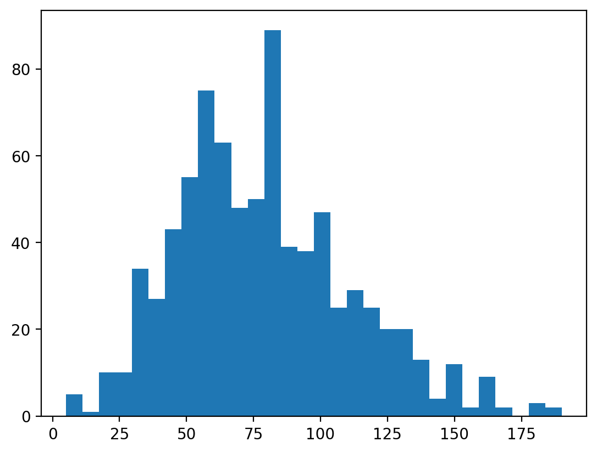
    


```python
### This has fewer bins
p = plt.hist(df_pokemon['Attack'], bins = 5)
```


    

    


#### Changing the `alpha` level

The `alpha` level changes the **transparency** of your figure.


```python
### This has fewer bins
p = plt.hist(df_pokemon['Attack'], alpha = .6)
```


    

    


#### Check-in:

How would you make a histogram of the scores for `Defense`?


```python
d = plt.hist(df_pokemon['Defense'])
```


    
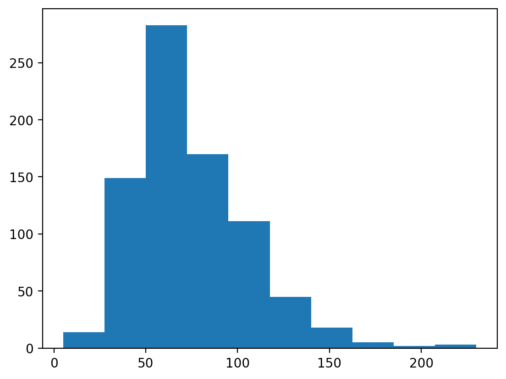
    


#### Check-in:

Could you make a histogram of the scores for `Type 1`?


```python
### Your code here
df_pokemon['Type 1'].value_counts().plot(kind='bar')
plt.show()

# This is a categorical variable, not a numerical one, so a bar plot is more appropriate.
t = plt.hist(df_pokemon['Type 1'], bins=40)
plt.xticks(rotation=45)
plt.show()


```


    
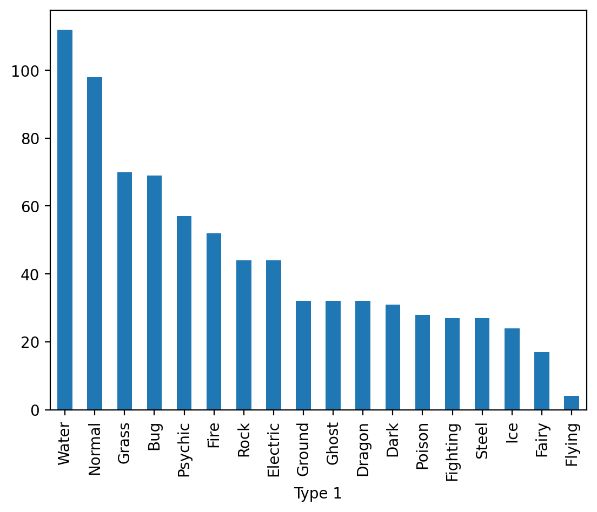
    


    
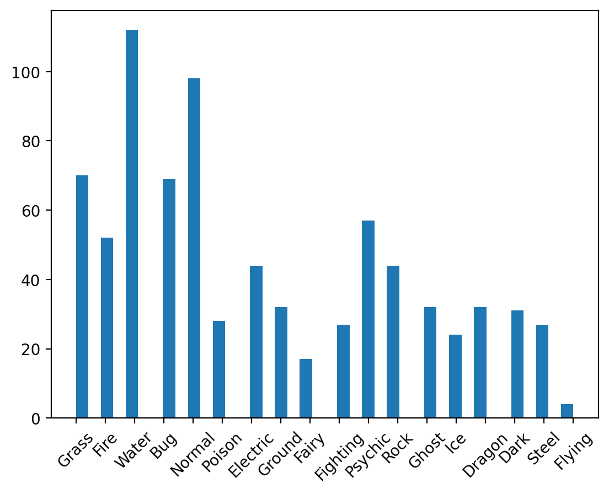
    


### Learning from histograms

Histograms are incredibly useful for learning about the **shape** of our distribution. We can ask questions like:

- Is this distribution relatively [normal](https://en.wikipedia.org/wiki/Normal_distribution)?
- Is the distribution [skewed](https://en.wikipedia.org/wiki/Skewness)?
- Are there [outliers](https://en.wikipedia.org/wiki/Outlier)?

#### Normally distributed data

We can use the `numpy.random.normal` function to create a **normal distribution**, then plot it.

A normal distribution has the following characteristics:

- Classic "bell" shape (**symmetric**).  
- Mean, median, and mode are all identical.


```python
norm = np.random.normal(loc = 10, scale = 1, size = 1000)
p = plt.hist(norm, alpha = .6)
```


    
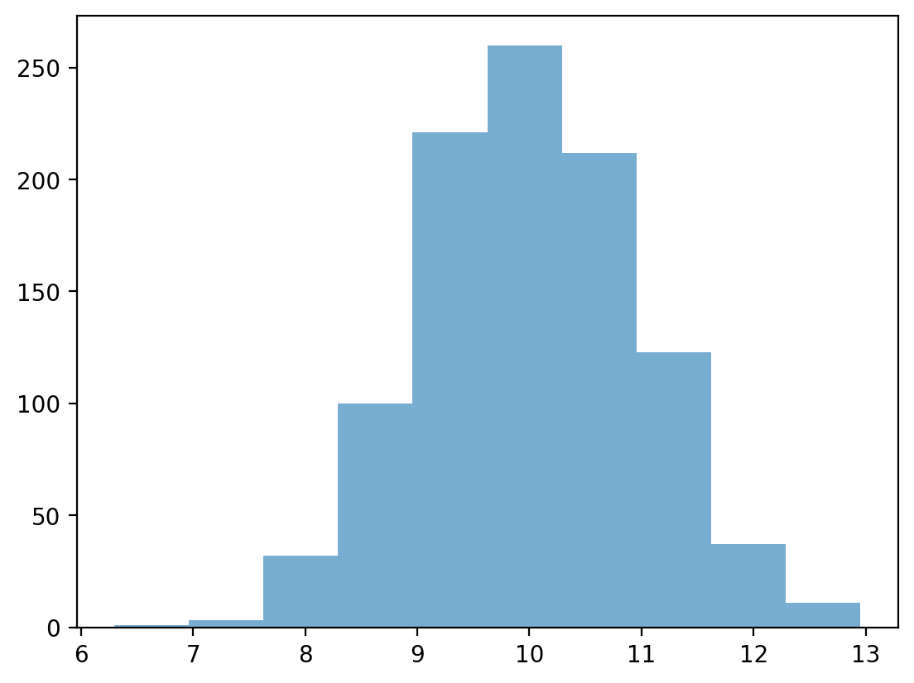
    


#### Skewed data

> **Skew** means there are values *elongating* one of the "tails" of a distribution.

- Positive/right skew: the tail is pointing to the right.  
- Negative/left skew: the tail is pointing to the left.


```python
rskew = ss.skewnorm.rvs(20, size = 1000) # make right-skewed data
lskew = ss.skewnorm.rvs(-20, size = 1000) # make left-skewed data
fig, axes = plt.subplots(1, 2)
axes[0].hist(rskew)
axes[0].set_title("Right-skewed")
axes[1].hist(lskew)
axes[1].set_title("Left-skewed")
```


    Text(0.5, 1.0, 'Left-skewed')


    
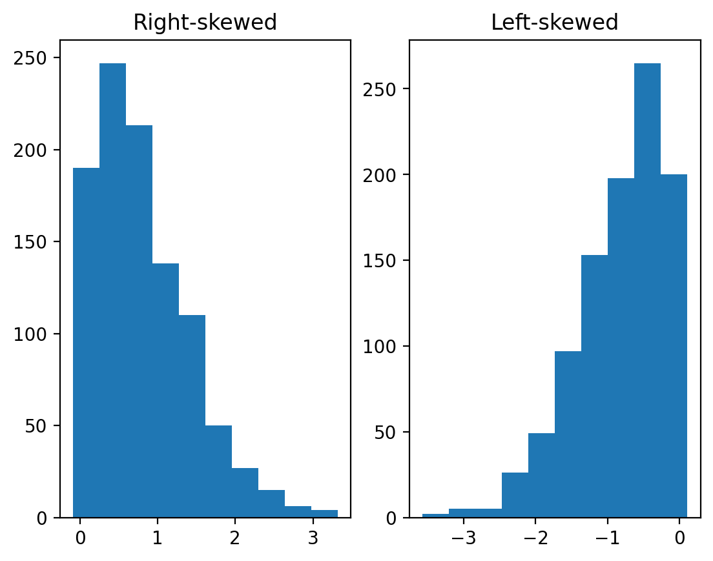
    


#### Outliers

> **Outliers** are data points that differ significantly from other points in a distribution.

- Unlike skewed data, outliers are generally **discontinuous** with the rest of the distribution.
- Next week, we'll talk about more ways to **identify** outliers; for now, we can rely on histograms.


```python
norm = np.random.normal(loc = 10, scale = 1, size = 1000)
upper_outliers = np.array([21, 21, 21, 21]) ## some random outliers
data = np.concatenate((norm, upper_outliers))
p = plt.hist(data, alpha = .6)
plt.arrow(20, 100, dx = 0, dy = -50, width = .3, head_length = 10, facecolor = "red")
```


    <matplotlib.patches.FancyArrow at 0x24a2fbdfa10>


    
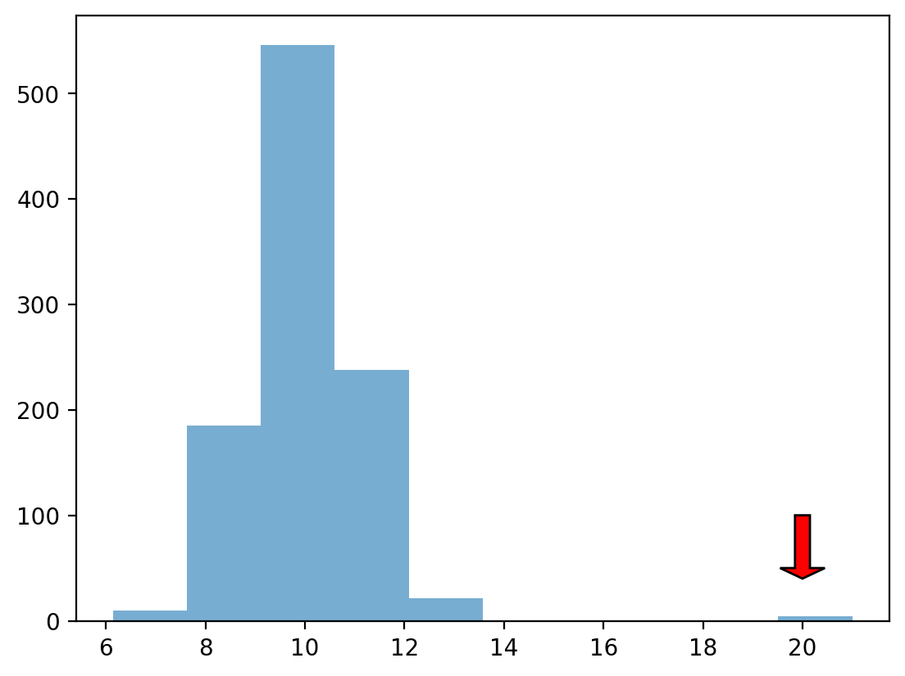
    


#### Check-in

How would you describe the following distribution?

- Normal vs. skewed?  
- With or without outliers?


```python
### Your code here
# The distribution is skewed (asymmetric) and contains outliers.
# Outliers are visible as points separated from the main body of the data.

```

#### Check-in

In a somewhat **right-skewed distribution** (like below), what's larger––the `mean` or the `median`?


```python
### Your code here
# In a right-skewed distribution, the mean is greater than the median because large values pull the mean to the right.
mean1=np.mean(rskew)
median1=np.median(rskew)
print(mean1)
print(median1)
```

    0.8083699162245512
    0.6874002987772154
    

### Modifying our plot

- A good data visualization should also make it *clear* what's being plotted.
   - Clearly labeled `x` and `y` axes, title.
- Sometimes, we may also want to add **overlays**. 
   - E.g., a dashed vertical line representing the `mean`.

#### Adding axis labels


```python
p = plt.hist(df_pokemon['Attack'], alpha = .6)
plt.xlabel("Attack")
plt.ylabel("Count")
plt.title("Distribution of Attack Scores")
```


    Text(0.5, 1.0, 'Distribution of Attack Scores')


    
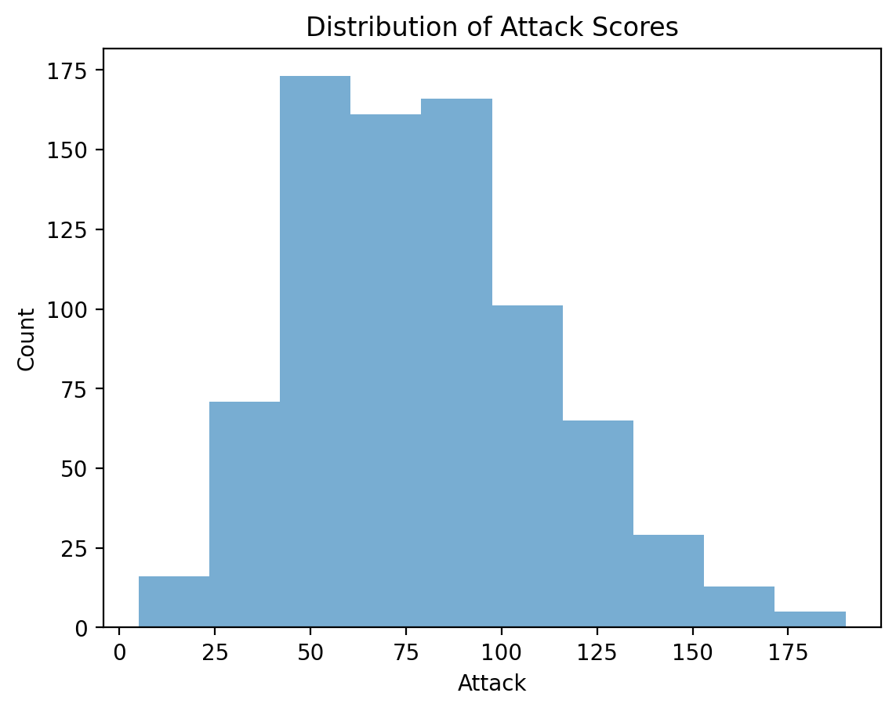
    


#### Adding a vertical line

The `plt.axvline` function allows us to draw a vertical line at a particular position, e.g., the `mean` of the `Attack` column.


```python
p = plt.hist(df_pokemon['Attack'], alpha = .6)
plt.xlabel("Attack")
plt.ylabel("Count")
plt.title("Distribution of Attack Scores")
plt.axvline(df_pokemon['Attack'].mean(), linestyle = "dotted")
```


    <matplotlib.lines.Line2D at 0x24a339b7390>


    

    


## Scatterplots

### What are scatterplots?

> A **scatterplot** is a visualization of how two different continuous distributions relate to each other.

- Each individual point represents an observation.
- Very useful for **exploratory data analysis**.
   - Are these variables positively or negatively correlated?
   
A scatterplot is a **bivariate** plot, i.e., it displays at least two variables.

### Scatterplots with `matplotlib`

We can create a scatterplot using `plt.scatter(x, y)`, where `x` and `y` are the two variables we want to visualize.


```python
x = np.arange(1, 10)
y = np.arange(11, 20)
p = plt.scatter(x, y)
```


    
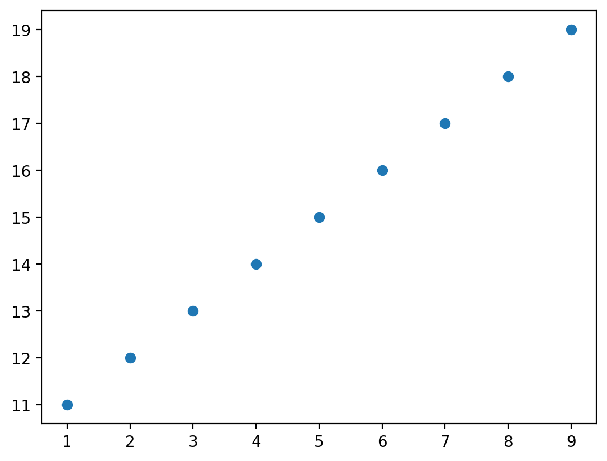
    


#### Check-in

Are these variables related? If so, how?


```python
x = np.random.normal(loc = 10, scale = 1, size = 100)
y = x * 2 + np.random.normal(loc = 0, scale = 2, size = 100)
plt.scatter(x, y, alpha = .6);
```


    
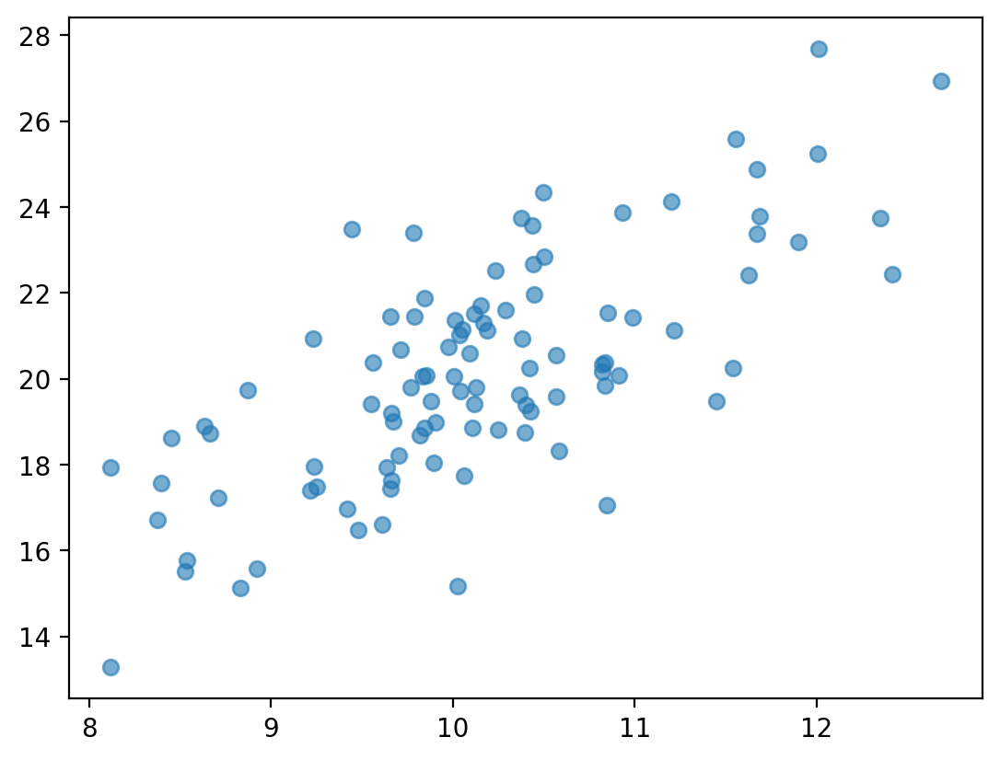
    


#### Check-in

Are these variables related? If so, how?


```python
x = np.random.normal(loc = 10, scale = 1, size = 100)
y = -x * 2 + np.random.normal(loc = 0, scale = 2, size = 100)
plt.scatter(x, y, alpha = .6);
```


    
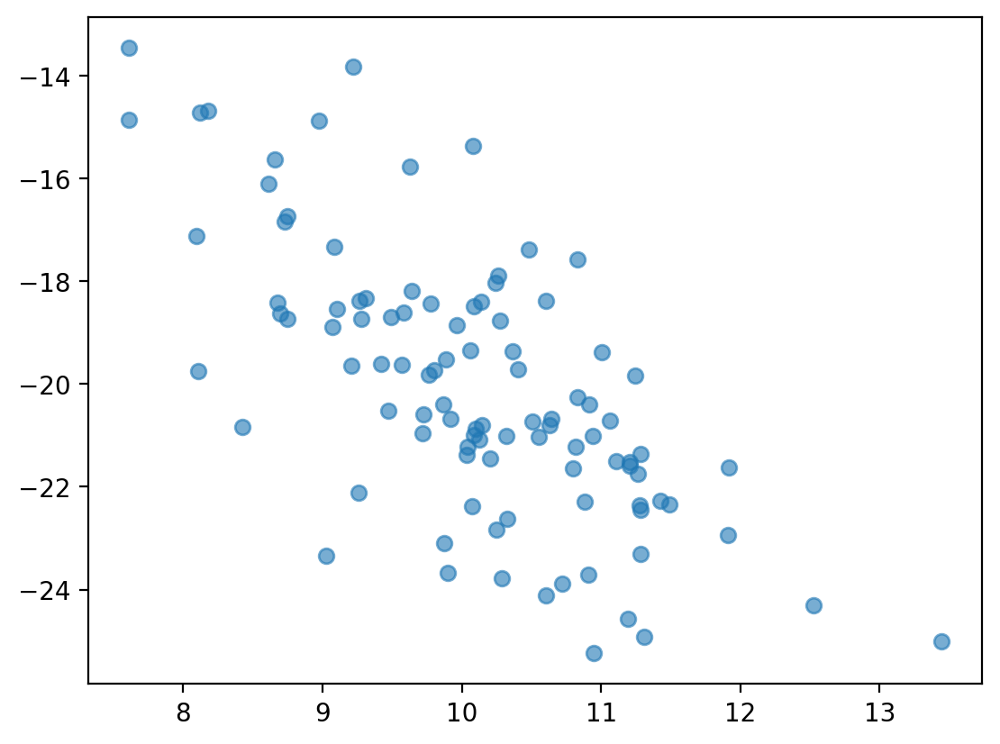
    


#### Scatterplots are useful for detecting non-linear relationships


```python
x = np.random.normal(loc = 10, scale = 1, size = 100)
y = np.sin(x)
plt.scatter(x, y, alpha = .6);
```


    
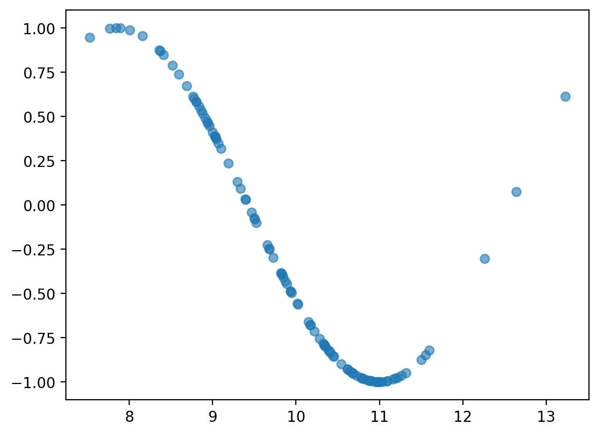
    


#### Check-in

How would we visualize the relationship between `Attack` and `Speed` in our Pokemon dataset?


```python
### Check-in
plt.scatter(df_pokemon['Attack'], df_pokemon['Speed'], alpha=0.6)
plt.xlabel('Attack')
plt.ylabel('Speed')
plt.title('Attack vs Speed')
plt.show()

```


    
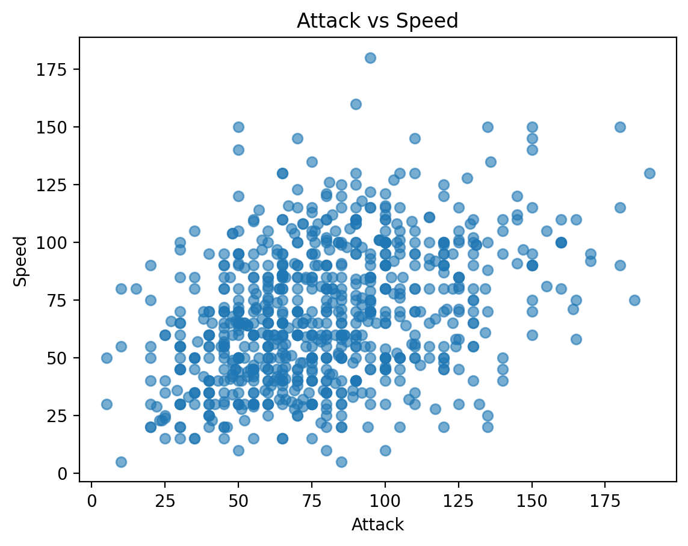
    


## Barplots

### What is a barplot?

> A **barplot** visualizes the relationship between one *continuous* variable and a *categorical* variable.

- The *height* of each bar generally indicates the mean of the continuous variable.
- Each bar represents a different *level* of the categorical variable.

A barplot is a **bivariate** plot, i.e., it displays at least two variables.

### Barplots with `matplotlib`

`plt.bar` can be used to create a **barplot** of our data.

- E.g., average `Attack` by `Legendary` status.
- However, we first need to use `groupby` to calculate the mean `Attack` per level.

#### Step 1: Using `groupby`


```python
summary = df_pokemon[['Legendary', 'Attack']].groupby("Legendary").mean().reset_index()
summary
```


<div>
<style scoped>
    .dataframe tbody tr th:only-of-type {
        vertical-align: middle;
    }

    .dataframe tbody tr th {
        vertical-align: top;
    }

    .dataframe thead th {
        text-align: right;
    }
</style>
<table border="1" class="dataframe">
  <thead>
    <tr style="text-align: right;">
      <th></th>
      <th>Legendary</th>
      <th>Attack</th>
    </tr>
  </thead>
  <tbody>
    <tr>
      <th>0</th>
      <td>False</td>
      <td>75.669388</td>
    </tr>
    <tr>
      <th>1</th>
      <td>True</td>
      <td>116.676923</td>
    </tr>
  </tbody>
</table>
</div>


```python
### Turn Legendary into a str
summary['Legendary'] = summary['Legendary'].apply(lambda x: str(x))
summary
```


<div>
<style scoped>
    .dataframe tbody tr th:only-of-type {
        vertical-align: middle;
    }

    .dataframe tbody tr th {
        vertical-align: top;
    }

    .dataframe thead th {
        text-align: right;
    }
</style>
<table border="1" class="dataframe">
  <thead>
    <tr style="text-align: right;">
      <th></th>
      <th>Legendary</th>
      <th>Attack</th>
    </tr>
  </thead>
  <tbody>
    <tr>
      <th>0</th>
      <td>False</td>
      <td>75.669388</td>
    </tr>
    <tr>
      <th>1</th>
      <td>True</td>
      <td>116.676923</td>
    </tr>
  </tbody>
</table>
</div>


#### Step 2: Pass values into `plt.bar`

**Check-in**:

- What do we learn from this plot?  
- What is this plot missing?


```python
plt.bar(x = summary['Legendary'],height = summary['Attack'],alpha = .6);
plt.xlabel("Legendary status");
plt.ylabel("Attack");

#The title was missing, which I am now adding:
plt.title("Average Attack by Legendary Status")

#What we learn from this plot?:
#Legendary Pokémon have a clearly higher average Attack than regular Pokémon.
```


    Text(0.5, 1.0, 'Average Attack by Legendary Status')


    
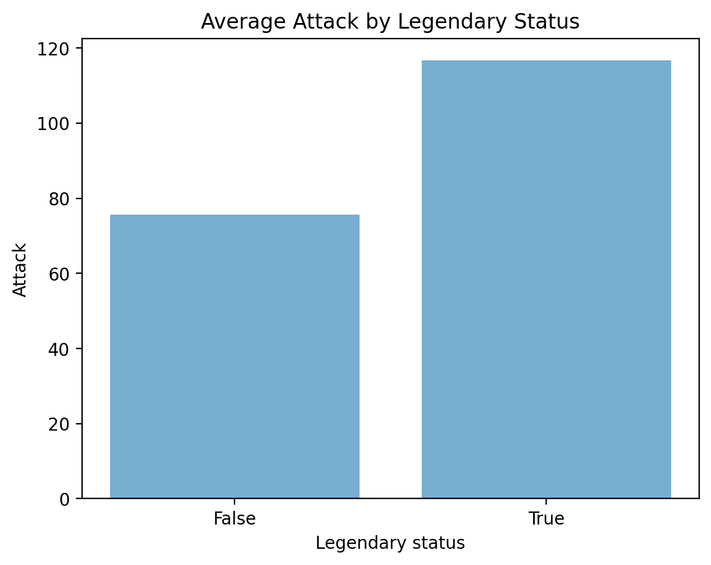
    


## Conclusion

This concludes our first introduction to **data visualization**:

- Working with `matplotlib.pyplot`.  
- Creating basic plots: histograms, scatterplots, and barplots.

Next time, we'll move onto discussing `seaborn`, another very useful package for data visualization.
