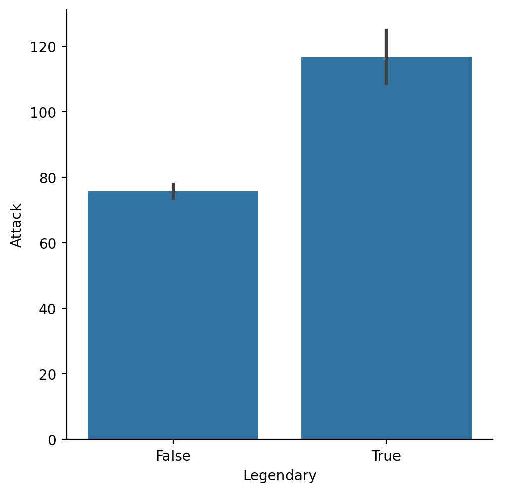

# Data visualization, pt. 2 (`seaborn`)

## Goals of this exercise

- Introducting `seaborn`. 
- Putting `seaborn` into practice:
  - **Univariate** plots (histograms).  
  - **Bivariate** continuous plots (scatterplots and line plots).
  - **Bivariate** categorical plots (bar plots, box plots, and strip plots).

## Introducing `seaborn`

### What is `seaborn`?

> [`seaborn`](https://seaborn.pydata.org/) is a data visualization library based on `matplotlib`.

- In general, it's easier to make nice-looking graphs with `seaborn`.
- The trade-off is that `matplotlib` offers more flexibility.


```python
import seaborn as sns ### importing seaborn
import pandas as pd
import matplotlib.pyplot as plt ## just in case we need it
import numpy as np
```


```python
%matplotlib inline 
%config InlineBackend.figure_format = 'retina'
```

### The `seaborn` hierarchy of plot types

We'll learn more about exactly what this hierarchy means today (and in next lecture).


### Example dataset

Today we'll work with a new dataset, from [Gapminder](https://www.gapminder.org/data/documentation/). 

- **Gapminder** is an independent Swedish foundation dedicated to publishing and analyzing data to correct misconceptions about the world.
- Between 1952-2007, has data about `life_exp`, `gdp_cap`, and `population`.


```python
df_gapminder = pd.read_csv("gapminder_full.csv")
```


```python
df_gapminder.head(2)
```


<div>
<style scoped>
    .dataframe tbody tr th:only-of-type {
        vertical-align: middle;
    }

    .dataframe tbody tr th {
        vertical-align: top;
    }

    .dataframe thead th {
        text-align: right;
    }
</style>
<table border="1" class="dataframe">
  <thead>
    <tr style="text-align: right;">
      <th></th>
      <th>country</th>
      <th>year</th>
      <th>population</th>
      <th>continent</th>
      <th>life_exp</th>
      <th>gdp_cap</th>
    </tr>
  </thead>
  <tbody>
    <tr>
      <th>0</th>
      <td>Afghanistan</td>
      <td>1952</td>
      <td>8425333</td>
      <td>Asia</td>
      <td>28.801</td>
      <td>779.445314</td>
    </tr>
    <tr>
      <th>1</th>
      <td>Afghanistan</td>
      <td>1957</td>
      <td>9240934</td>
      <td>Asia</td>
      <td>30.332</td>
      <td>820.853030</td>
    </tr>
  </tbody>
</table>
</div>


```python
df_gapminder.shape
```


    (1704, 6)


## Univariate plots

> A **univariate plot** is a visualization of only a *single* variable, i.e., a **distribution**.


### Histograms with `sns.histplot`

- We've produced histograms with `plt.hist`.  
- With `seaborn`, we can use `sns.histplot(...)`.

Rather than use `df['col_name']`, we can use the syntax:

```python
sns.histplot(data = df, x = col_name)
```

This will become even more useful when we start making **bivariate plots**.


```python
# Histogram of life expectancy
sns.histplot(df_gapminder['life_exp']);
```


    

    


#### Modifying the number of bins

As with `plt.hist`, we can modify the number of *bins*.


```python
# Fewer bins
sns.histplot(data = df_gapminder, x = 'life_exp', bins = 10, alpha = .6);
```


    

    


```python
# Many more bins!
sns.histplot(data = df_gapminder, x = 'life_exp', bins = 100, alpha = .6);
```


    

    


#### Modifying the y-axis with `stat`

By default, `sns.histplot` will plot the **count** in each bin. However, we can change this using the `stat` parameter:

- `probability`: normalize such that bar heights sum to `1`.
- `percent`: normalize such that bar heights sum to `100`.
- `density`: normalize such that total *area* sums to `1`.


```python
# Note the modified y-axis!
sns.histplot(data = df_gapminder, x = 'life_exp', stat = "percent", alpha = .6);
```


    

    


### Check-in

How would you make a histogram showing the distribution of `population` values in `2007` alone? 

- Bonus 1: Modify this graph to show `probability`, not `count`.
- Bonus 2: What do you notice about this graph, and how might you change it?


```python
### Your code here
sns.histplot(data = df_gapminder[df_gapminder['year'] == 2007], x = 'population', stat = "probability", alpha = .6);
plt.show()
```


    

    


## Bivariate continuous plots

> A **bivariate continuous plot** visualizes the relationship between *two continuous variables*.


### Scatterplots with `sns.scatterplot`

> A **scatterplot** visualizes the relationship between two continuous variables.

- Each observation is plotted as a single dot/mark. 
- The position on the `(x, y)` axes reflects the value of those variables.

One way to make a scatterplot in `seaborn` is using `sns.scatterplot`.

#### Showing `gdp_cap` by `life_exp`

What do we notice about `gdp_cap`?


```python
sns.scatterplot(data = df_gapminder, x = 'gdp_cap',
               y = 'life_exp', alpha = .3);
```


    

    


#### Showing `gdp_cap_log` by `life_exp`


```python
## Log GDP
df_gapminder['gdp_cap_log'] = np.log10(df_gapminder['gdp_cap']) 
## Show log GDP by life exp
sns.scatterplot(data = df_gapminder, x = 'gdp_cap_log', y = 'life_exp', alpha = .3);
```


    

    


#### Adding a `hue`

- What if we want to add a *third* component that's categorical, like `continent`?
- `seaborn` allows us to do this with `hue`.


```python
## Log GDP
df_gapminder['gdp_cap_log'] = np.log10(df_gapminder['gdp_cap']) 
## Show log GDP by life exp
sns.scatterplot(data = df_gapminder[df_gapminder['year'] == 2007],
               x = 'gdp_cap_log', y = 'life_exp', hue = "continent", alpha = .7);
```


    

    


#### Adding a `size`

- What if we want to add a *fourth* component that's continuous, like `population`?
- `seaborn` allows us to do this with `size`.


```python
## Log GDP
df_gapminder['gdp_cap_log'] = np.log10(df_gapminder['gdp_cap']) 
## Show log GDP by life exp
sns.scatterplot(data = df_gapminder[df_gapminder['year'] == 2007],
               x = 'gdp_cap_log', y = 'life_exp',
                hue = "continent", size = 'population', alpha = .7);
```


    

    


#### Changing the position of the legend


```python
## Show log GDP by life exp
sns.scatterplot(data = df_gapminder[df_gapminder['year'] == 2007],
               x = 'gdp_cap_log', y = 'life_exp',
                hue = "continent", size = 'population', alpha = .7);

plt.legend(bbox_to_anchor=(1.05, 1), loc='upper left', borderaxespad=0);
```


    

    


### Lineplots with `sns.lineplot`

> A **lineplot** also visualizes the relationship between two continuous variables.

- Typically, the position of the line on the `y` axis reflects the *mean* of the `y`-axis variable for that value of `x`.
- Often used for plotting **change over time**.

One way to make a lineplot in `seaborn` is using [`sns.lineplot`](https://seaborn.pydata.org/generated/seaborn.lineplot.html).

#### Showing `life_exp` by `year`

What general trend do we notice?


```python
sns.lineplot(data = df_gapminder,
             x = 'year',
             y = 'life_exp');
```


    

    


#### Modifying how error/uncertainty is displayed

- By default, `seaborn.lineplot` will draw **shading** around the line representing a confidence interval.
- We can change this with `errstyle`.


```python
sns.lineplot(data = df_gapminder,
             x = 'year',
             y = 'life_exp',
            err_style = "bars");
```


    

    


#### Adding a `hue`

- We could also show this by `continent`.  
- There's (fortunately) a positive trend line for each `continent`.


```python
sns.lineplot(data = df_gapminder,
             x = 'year',
             y = 'life_exp',
            hue = "continent")
plt.legend(bbox_to_anchor=(1.05, 1), loc='upper left', borderaxespad=0);
```


    

    


#### Check-in

How would you plot the relationship between `year` and `gdp_cap` for countries in the `Americas` only?


```python
sns.lineplot(data = df_gapminder[df_gapminder['continent'] == 'Americas'],
             x = 'year',
             y = 'gdp_cap',
            hue = "country")
plt.legend(bbox_to_anchor=(1.10, 1), loc='upper left', borderaxespad=0);
```


    

    


#### Heteroskedasticity in `gdp_cap` by `year`

- [**Heteroskedasticity**](https://en.wikipedia.org/wiki/Homoscedasticity_and_heteroscedasticity) is when the *variance* in one variable (e.g., `gdp_cap`) changes as a function of another variable (e.g., `year`).
- In this case, why do you think that is?

#### Plotting by country

- There are too many countries to clearly display in the `legend`. 
- But the top two lines are the `United States` and `Canada`.
   - I.e., two countries have gotten much wealthier per capita, while the others have not seen the same economic growth.


```python
important_countries = ['United States', 'Canada']

sns.lineplot(
    data = df_gapminder[(df_gapminder['continent'] == 'Americas') & 
                        (df_gapminder['country'].isin(important_countries))],
    x = 'year',
    y = 'gdp_cap',
    hue = 'country'
)
plt.legend(bbox_to_anchor=(1.05, 1), loc='upper left', borderaxespad=0)
plt.show()

```


    

    


### Using `relplot`

- `relplot` allows you to plot either line plots or scatter plots using `kind`.
- `relplot` also makes it easier to `facet` (which we'll discuss momentarily).


```python
sns.relplot(data = df_gapminder, x = "year", y = "life_exp", kind = "line");
```


    

    


#### Faceting into `rows` and `cols`

We can also plot the same relationship across multiple "windows" or **facets** by adding a `rows`/`cols` parameter.


```python
sns.relplot(data = df_gapminder, x = "year", y = "life_exp", kind = "line", 
            col = "continent");
```


    

    


## Bivariate categorical plots

> A **bivariate categorical plot** visualizes the relationship between one categorical variable and one continuous variable.


### Example dataset

Here, we'll return to our Pokemon dataset, which has more examples of categorical variables.


```python
df_pokemon = pd.read_csv("pokemon.csv")
```

### Barplots with `sns.barplot`

> A **barplot** visualizes the relationship between one *continuous* variable and a *categorical* variable.

- The *height* of each bar generally indicates the mean of the continuous variable.
- Each bar represents a different *level* of the categorical variable.

With `seaborn`, we can use the function `sns.barplot`.

#### Average `Attack` by `Legendary` status


```python
sns.barplot(data = df_pokemon,
           x = "Legendary", y = "Attack");
```


    

    


#### Average `Attack` by `Type 1`

Here, notice that I make the figure *bigger*, to make sure the labels all fit.


```python
plt.figure(figsize=(15,4))
sns.barplot(data = df_pokemon,
           x = "Type 1", y = "Attack");
```


    

    


#### Check-in

How would you plot `HP` by `Type 1`?


```python
### Your code here
plt.figure(figsize=(15,4))
sns.barplot(data = df_pokemon,
           x = "Type 1", y = "HP");
```


    

    


#### Modifying `hue`

As with `scatterplot` and `lineplot`, we can change the `hue` to give further granularity.

- E.g., `HP` by `Type 1`, further divided by `Legendary` status.


```python
plt.figure(figsize=(15,4))
sns.barplot(data = df_pokemon,
           x = "Type 1", y = "HP", hue = "Legendary");
```


    

    


### Using `catplot`

> `seaborn.catplot` is a convenient function for plotting bivariate categorical data using a range of plot types (`bar`, `box`, `strip`).


```python
sns.catplot(data = df_pokemon, x = "Legendary", 
             y = "Attack", kind = "bar");
```


    

    


#### `strip` plots

> A `strip` plot shows each individual point (like a scatterplot), divided by a **category label**.


```python
sns.catplot(data = df_pokemon, x = "Legendary", 
             y = "Attack", kind = "strip", alpha = .5);
```


    

    


#### Adding a `mean` to our `strip` plot

We can plot *two graphs* at the same time, showing both the individual points and the means.


```python
sns.catplot(data = df_pokemon, x = "Legendary", 
             y = "Attack", kind = "strip", alpha = .1)
sns.pointplot(data = df_pokemon, x = "Legendary", 
             y = "Attack", hue = "Legendary");
```


    

    


#### `box` plots

> A `box` plot shows the interquartile range (the middle 50% of the data), along with the minimum and maximum.


```python
sns.catplot(data = df_pokemon, x = "Legendary", 
             y = "Attack", kind = "box");
```


    

    


Try to consider converting the boxplots into violin plots.

## Conclusion

As with our lecture on `pyplot`, this just scratches the surface.

But now, you've had an introduction to:

- The `seaborn` package.
- Plotting both **univariate** and **bivariate** data.
- Creating plots with multiple layers.
