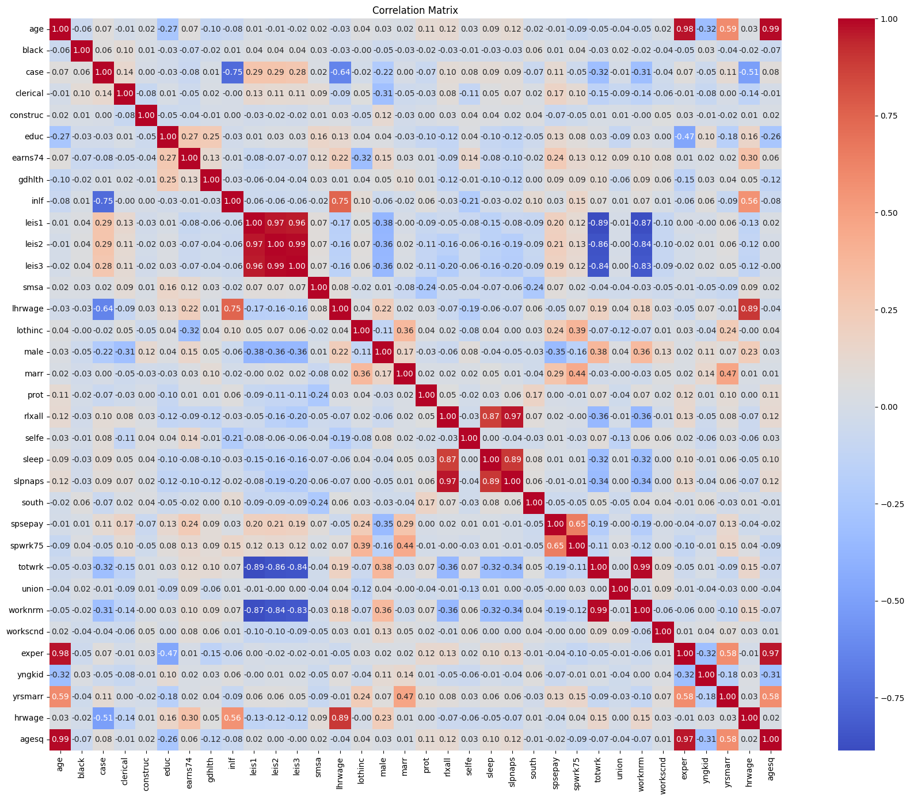
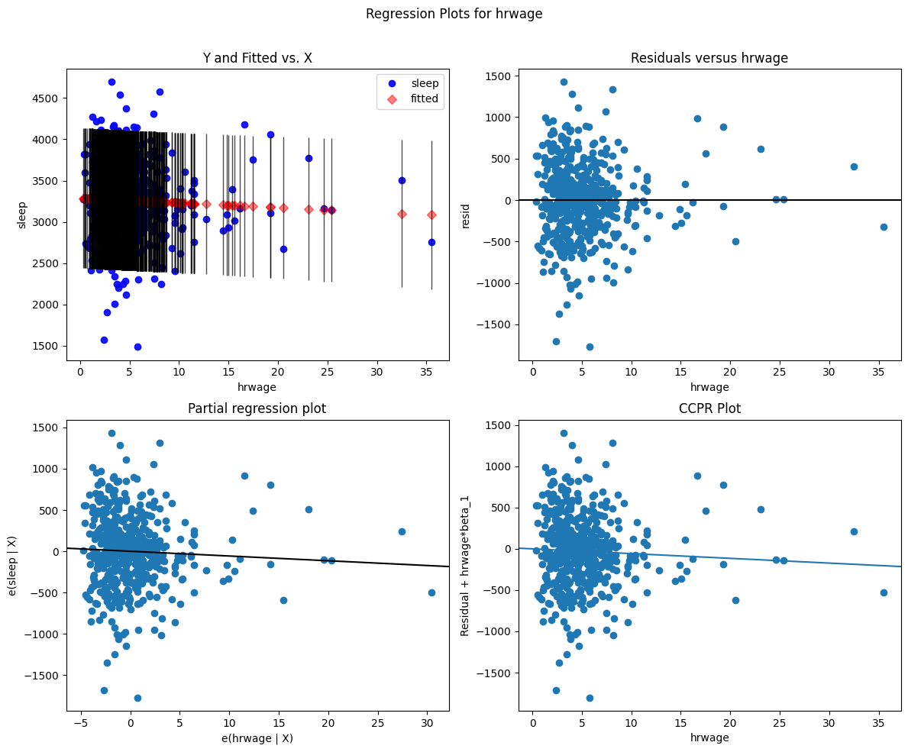
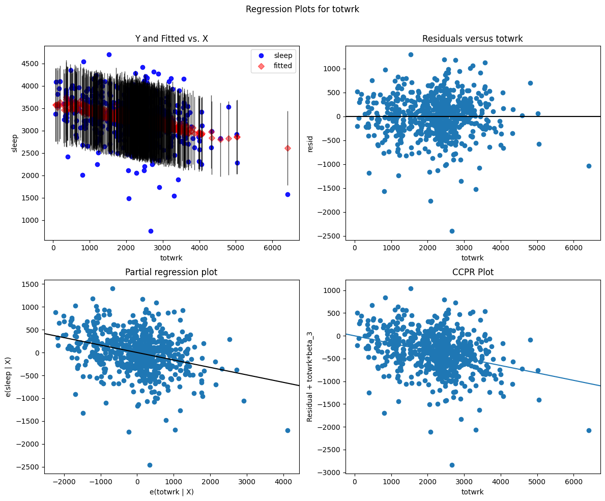

#### Multivariate analysis - sleep dataset
Robert Gosz

First of all I will import the dataset. I have seen that we have no column names in a 'sleep75.xls' file, so i have to name them first and i expoerted the column names from description file


```python
import pandas as pd
import numpy as np
df = pd.read_excel('sleep75.xls', header=None)


columns = [
    "age", "black", "case", "clerical", "construc", "educ", "earns74", "gdhlth",
    "inlf", "leis1", "leis2", "leis3", "smsa", "lhrwage", "lothinc", "male",
    "marr", "prot", "rlxall", "selfe", "sleep", "slpnaps", "south", "spsepay",
    "spwrk75", "totwrk", "union", "worknrm", "workscnd", "exper", "yngkid", "yrsmarr",
    "hrwage", "agesq"
]
df.columns=columns
df.head()
df

```


<div>
<style scoped>
    .dataframe tbody tr th:only-of-type {
        vertical-align: middle;
    }

    .dataframe tbody tr th {
        vertical-align: top;
    }

    .dataframe thead th {
        text-align: right;
    }
</style>
<table border="1" class="dataframe">
  <thead>
    <tr style="text-align: right;">
      <th></th>
      <th>age</th>
      <th>black</th>
      <th>case</th>
      <th>clerical</th>
      <th>construc</th>
      <th>educ</th>
      <th>earns74</th>
      <th>gdhlth</th>
      <th>inlf</th>
      <th>leis1</th>
      <th>...</th>
      <th>spwrk75</th>
      <th>totwrk</th>
      <th>union</th>
      <th>worknrm</th>
      <th>workscnd</th>
      <th>exper</th>
      <th>yngkid</th>
      <th>yrsmarr</th>
      <th>hrwage</th>
      <th>agesq</th>
    </tr>
  </thead>
  <tbody>
    <tr>
      <th>0</th>
      <td>32</td>
      <td>0</td>
      <td>1</td>
      <td>0.000000</td>
      <td>0.000000</td>
      <td>12</td>
      <td>0</td>
      <td>0</td>
      <td>1</td>
      <td>3529</td>
      <td>...</td>
      <td>0</td>
      <td>3438</td>
      <td>0</td>
      <td>3438</td>
      <td>0</td>
      <td>14</td>
      <td>0</td>
      <td>13</td>
      <td>7.070004</td>
      <td>1024</td>
    </tr>
    <tr>
      <th>1</th>
      <td>31</td>
      <td>0</td>
      <td>2</td>
      <td>0.000000</td>
      <td>0.000000</td>
      <td>14</td>
      <td>9500</td>
      <td>1</td>
      <td>1</td>
      <td>2140</td>
      <td>...</td>
      <td>0</td>
      <td>5020</td>
      <td>0</td>
      <td>5020</td>
      <td>0</td>
      <td>11</td>
      <td>0</td>
      <td>0</td>
      <td>1.429999</td>
      <td>961</td>
    </tr>
    <tr>
      <th>2</th>
      <td>44</td>
      <td>0</td>
      <td>3</td>
      <td>0.000000</td>
      <td>0.000000</td>
      <td>17</td>
      <td>42500</td>
      <td>1</td>
      <td>1</td>
      <td>4595</td>
      <td>...</td>
      <td>1</td>
      <td>2815</td>
      <td>0</td>
      <td>2815</td>
      <td>0</td>
      <td>21</td>
      <td>0</td>
      <td>0</td>
      <td>20.53</td>
      <td>1936</td>
    </tr>
    <tr>
      <th>3</th>
      <td>30</td>
      <td>0</td>
      <td>4</td>
      <td>0.000000</td>
      <td>0.000000</td>
      <td>12</td>
      <td>42500</td>
      <td>1</td>
      <td>1</td>
      <td>3211</td>
      <td>...</td>
      <td>1</td>
      <td>3786</td>
      <td>0</td>
      <td>3786</td>
      <td>0</td>
      <td>12</td>
      <td>0</td>
      <td>12</td>
      <td>9.619998</td>
      <td>900</td>
    </tr>
    <tr>
      <th>4</th>
      <td>64</td>
      <td>0</td>
      <td>5</td>
      <td>0.000000</td>
      <td>0.000000</td>
      <td>14</td>
      <td>2500</td>
      <td>1</td>
      <td>1</td>
      <td>4052</td>
      <td>...</td>
      <td>1</td>
      <td>2580</td>
      <td>0</td>
      <td>2580</td>
      <td>0</td>
      <td>44</td>
      <td>0</td>
      <td>33</td>
      <td>2.75</td>
      <td>4096</td>
    </tr>
    <tr>
      <th>...</th>
      <td>...</td>
      <td>...</td>
      <td>...</td>
      <td>...</td>
      <td>...</td>
      <td>...</td>
      <td>...</td>
      <td>...</td>
      <td>...</td>
      <td>...</td>
      <td>...</td>
      <td>...</td>
      <td>...</td>
      <td>...</td>
      <td>...</td>
      <td>...</td>
      <td>...</td>
      <td>...</td>
      <td>...</td>
      <td>...</td>
      <td>...</td>
    </tr>
    <tr>
      <th>701</th>
      <td>45</td>
      <td>0</td>
      <td>702</td>
      <td>0.182331</td>
      <td>0.030075</td>
      <td>12</td>
      <td>5500</td>
      <td>1</td>
      <td>0</td>
      <td>5069</td>
      <td>...</td>
      <td>1</td>
      <td>2026</td>
      <td>0</td>
      <td>2026</td>
      <td>0</td>
      <td>27</td>
      <td>0</td>
      <td>18</td>
      <td>.</td>
      <td>2025</td>
    </tr>
    <tr>
      <th>702</th>
      <td>34</td>
      <td>0</td>
      <td>703</td>
      <td>0.182331</td>
      <td>0.030075</td>
      <td>10</td>
      <td>2500</td>
      <td>0</td>
      <td>0</td>
      <td>5885</td>
      <td>...</td>
      <td>0</td>
      <td>675</td>
      <td>1</td>
      <td>465</td>
      <td>210</td>
      <td>18</td>
      <td>0</td>
      <td>4</td>
      <td>.</td>
      <td>1156</td>
    </tr>
    <tr>
      <th>703</th>
      <td>37</td>
      <td>0</td>
      <td>704</td>
      <td>0.182331</td>
      <td>0.030075</td>
      <td>12</td>
      <td>3500</td>
      <td>1</td>
      <td>0</td>
      <td>4719</td>
      <td>...</td>
      <td>1</td>
      <td>1851</td>
      <td>0</td>
      <td>1851</td>
      <td>0</td>
      <td>19</td>
      <td>0</td>
      <td>17</td>
      <td>.</td>
      <td>1369</td>
    </tr>
    <tr>
      <th>704</th>
      <td>54</td>
      <td>0</td>
      <td>705</td>
      <td>0.182331</td>
      <td>0.030075</td>
      <td>17</td>
      <td>32500</td>
      <td>1</td>
      <td>0</td>
      <td>5149</td>
      <td>...</td>
      <td>1</td>
      <td>1961</td>
      <td>1</td>
      <td>1481</td>
      <td>480</td>
      <td>31</td>
      <td>0</td>
      <td>22</td>
      <td>.</td>
      <td>2916</td>
    </tr>
    <tr>
      <th>705</th>
      <td>30</td>
      <td>0</td>
      <td>706</td>
      <td>0.182331</td>
      <td>0.030075</td>
      <td>16</td>
      <td>6750</td>
      <td>1</td>
      <td>0</td>
      <td>4747</td>
      <td>...</td>
      <td>0</td>
      <td>2363</td>
      <td>0</td>
      <td>2363</td>
      <td>0</td>
      <td>8</td>
      <td>1</td>
      <td>9</td>
      <td>.</td>
      <td>900</td>
    </tr>
  </tbody>
</table>
<p>706 rows × 34 columns</p>
</div>


```python
complete_cases = df.dropna().shape[0]
percentage_complete = (complete_cases / df.shape[0]) * 100

print(f"Number of complete cases: {complete_cases}")
print(f"Percentage of complete cases: {percentage_complete:.2f}%")
```

    Number of complete cases: 706
    Percentage of complete cases: 100.00%
    


```python
df.dtypes
```


    age           int64
    black         int64
    case          int64
    clerical    float64
    construc    float64
    educ          int64
    earns74       int64
    gdhlth        int64
    inlf          int64
    leis1         int64
    leis2         int64
    leis3         int64
    smsa          int64
    lhrwage      object
    lothinc     float64
    male          int64
    marr          int64
    prot          int64
    rlxall        int64
    selfe         int64
    sleep         int64
    slpnaps       int64
    south         int64
    spsepay       int64
    spwrk75       int64
    totwrk        int64
    union         int64
    worknrm       int64
    workscnd      int64
    exper         int64
    yngkid        int64
    yrsmarr       int64
    hrwage       object
    agesq         int64
    dtype: object


I checked in data wrangler extenstion that the issue that columns: 'lhrwage' and 'hrwage' are objects was that some of values was representated as a '.' so I will replace them with the mode.


```python
df['lhrwage'] = df['lhrwage'].replace('.', np.nan)
df['lhrwage'] = pd.to_numeric(df['lhrwage'], errors='coerce')
df['lhrwage'] = df['lhrwage'].fillna(0)
df['hrwage'] = df['hrwage'].replace('.', np.nan)
df['hrwage'] = pd.to_numeric(df['hrwage'], errors='coerce')
df['hrwage'] = df['hrwage'].fillna(0)
print(df.dtypes)
```

    age           int64
    black         int64
    case          int64
    clerical    float64
    construc    float64
    educ          int64
    earns74       int64
    gdhlth        int64
    inlf          int64
    leis1         int64
    leis2         int64
    leis3         int64
    smsa          int64
    lhrwage     float64
    lothinc     float64
    male          int64
    marr          int64
    prot          int64
    rlxall        int64
    selfe         int64
    sleep         int64
    slpnaps       int64
    south         int64
    spsepay       int64
    spwrk75       int64
    totwrk        int64
    union         int64
    worknrm       int64
    workscnd      int64
    exper         int64
    yngkid        int64
    yrsmarr       int64
    hrwage      float64
    agesq         int64
    dtype: object
    

    C:\Users\robert\AppData\Local\Temp\ipykernel_25424\1783030979.py:1: FutureWarning: Downcasting behavior in `replace` is deprecated and will be removed in a future version. To retain the old behavior, explicitly call `result.infer_objects(copy=False)`. To opt-in to the future behavior, set `pd.set_option('future.no_silent_downcasting', True)`
      df['lhrwage'] = df['lhrwage'].replace('.', np.nan)
    C:\Users\robert\AppData\Local\Temp\ipykernel_25424\1783030979.py:4: FutureWarning: Downcasting behavior in `replace` is deprecated and will be removed in a future version. To retain the old behavior, explicitly call `result.infer_objects(copy=False)`. To opt-in to the future behavior, set `pd.set_option('future.no_silent_downcasting', True)`
      df['hrwage'] = df['hrwage'].replace('.', np.nan)
    

TO DO:
MODEL SLEEP VS LHRWAGE
 
MODEL Z 5 NAJLEPOSZYMI
POTEM POROWNAC WYKRESIKI I WYCIAGNAC WNIOSKI


```python

```

Buliding Simple Model just to measure the real 


```python
import statsmodels.api as sm

df_working = df[df['hrwage'] != 0]
X = df_working[['hrwage']]
X = sm.add_constant(X)
y = df_working['sleep']
model = sm.OLS(y, X).fit()
print(model.summary())

```

                                OLS Regression Results                            
    ==============================================================================
    Dep. Variable:                  sleep   R-squared:                       0.002
    Model:                            OLS   Adj. R-squared:                  0.001
    Method:                 Least Squares   F-statistic:                     1.299
    Date:                Sun, 01 Jun 2025   Prob (F-statistic):              0.255
    Time:                        20:10:35   Log-Likelihood:                -3980.9
    No. Observations:                 532   AIC:                             7966.
    Df Residuals:                     530   BIC:                             7974.
    Df Model:                           1                                         
    Covariance Type:            nonrobust                                         
    ==============================================================================
                     coef    std err          t      P>|t|      [0.025      0.975]
    ------------------------------------------------------------------------------
    const       3288.7081     31.735    103.630      0.000    3226.366    3351.050
    hrwage        -5.7531      5.047     -1.140      0.255     -15.668       4.162
    ==============================================================================
    Omnibus:                       14.968   Durbin-Watson:                   1.887
    Prob(Omnibus):                  0.001   Jarque-Bera (JB):               27.683
    Skew:                          -0.133   Prob(JB):                     9.74e-07
    Kurtosis:                       4.085   Cond. No.                         10.9
    ==============================================================================
    
    Notes:
    [1] Standard Errors assume that the covariance matrix of the errors is correctly specified.
    

####  Results Summary:
- **Coefficient on `hrwage`**: `-5.75`  
  → Suggests that each additional unit increase in hourly wage is associated with **approximately 5.75 fewer minutes of sleep per day**, on average.

- **P-value**: `0.255`  
  → The coefficient is **not statistically significant** at conventional levels (p > 0.05).

- **R-squared**: `0.002`  
  → The model explains only **0.2% of the variation** in sleep duration.

- **Model Fit**:  
  Low explanatory power, indicating that `hrwage` alone is a poor predictor of sleep time.

####  Interpretation:

The baseline model shows a weak and statistically insignificant negative relationship between hourly wage and sleep time. This implies that higher wages **may** be associated with slightly less sleep, but the effect is not reliable or meaningful in isolation.

To improve the model, i will perform  Forward stepwise selection controling the columns which may bias (and is high corellation beetween) the most my model


```python
import matplotlib.pyplot as plt
import seaborn as sns

plt.figure(figsize=(20, 14))
corr_matrix = df.corr()  # Compute pairwise correlations
sns.heatmap(corr_matrix, annot=True, fmt=".2f", cmap="coolwarm", square=True)
plt.title("Correlation Matrix")
plt.tight_layout()
plt.show()
```


    

    


### Selection of Explanatory Variables

Based on the work by Biddle and Hamermesh (*"Sleep and the Allocation of Time"*) and standard economic reasoning, I selected the following variables for inclusion in the regression model explaining weekly sleep time:

- **agesq**: to account for the nonlinear effect of age,
- **educ**: years of education, as a proxy for human capital,
- **hrwage**: hourly wage (only available for those who work),
- **inlf**: in labor force indicator,
- **totwrk**: total work time per week,
- **marr**: marital status,
- **yngkid**: presence of young children,
- **union**, **selfe**: employment characteristics,
- **gdhlth**: general health status,
- **south**, **smsa**, **black**: regional and demographic controls.


```python
import statsmodels.api as sm
from sklearn.feature_selection import SequentialFeatureSelector
from sklearn.linear_model import LinearRegression

features = [
    'agesq', 'educ', 'hrwage', 'inlf', 'totwrk', 'marr',
    'yngkid', 'union', 'selfe', 'gdhlth', 'south', 'smsa', 'black'
]
df_working = df[df['totwrk'] != 0]

X = df_working[features]
y = df_working['sleep']

lr = LinearRegression()

# Forward stepwise selection
sfs_forward = SequentialFeatureSelector(
    lr,
    n_features_to_select='auto',
    direction='forward',
    cv=5
)
sfs_forward.fit(X, y)

selected_columns = X.columns[sfs_forward.get_support()].tolist()
print("Selected features (forward):", selected_columns)

# Budujemy model OLS na wybranych cechach
X_selected = sm.add_constant(X[selected_columns])
model_selected = sm.OLS(y, X_selected).fit()

# Podsumowanie nowego modelu
print(model_selected.summary())


```

    Selected features (forward): ['agesq', 'educ', 'totwrk', 'gdhlth', 'south', 'smsa']
                                OLS Regression Results                            
    ==============================================================================
    Dep. Variable:                  sleep   R-squared:                       0.124
    Model:                            OLS   Adj. R-squared:                  0.116
    Method:                 Least Squares   F-statistic:                     15.81
    Date:                Sun, 01 Jun 2025   Prob (F-statistic):           5.01e-17
    Time:                        20:13:45   Log-Likelihood:                -5029.3
    No. Observations:                 676   AIC:                         1.007e+04
    Df Residuals:                     669   BIC:                         1.010e+04
    Df Model:                           6                                         
    Covariance Type:            nonrobust                                         
    ==============================================================================
                     coef    std err          t      P>|t|      [0.025      0.975]
    ------------------------------------------------------------------------------
    const       3725.1318    105.400     35.343      0.000    3518.177    3932.087
    agesq          0.0290      0.018      1.645      0.100      -0.006       0.064
    educ          -6.4005      6.177     -1.036      0.300     -18.529       5.728
    totwrk        -0.1631      0.019     -8.689      0.000      -0.200      -0.126
    gdhlth       -74.4266     53.757     -1.384      0.167    -179.980      31.127
    south         84.6842     41.882      2.022      0.044       2.448     166.921
    smsa         -53.0118     33.979     -1.560      0.119    -119.729      13.706
    ==============================================================================
    Omnibus:                       78.011   Durbin-Watson:                   1.945
    Prob(Omnibus):                  0.000   Jarque-Bera (JB):              231.123
    Skew:                          -0.558   Prob(JB):                     6.49e-51
    Kurtosis:                       5.638   Cond. No.                     1.94e+04
    ==============================================================================
    
    Notes:
    [1] Standard Errors assume that the covariance matrix of the errors is correctly specified.
    [2] The condition number is large, 1.94e+04. This might indicate that there are
    strong multicollinearity or other numerical problems.
    

#### 1. Overall Model Quality

| Statistic               | Value         | Interpretation                                           |
|-------------------------|---------------|----------------------------------------------------------|
| **R-squared**           | 0.124         | The model explains 12.4% of the variance in `sleep`      |
| **Adjusted R-squared**  | 0.116         | Adjusted for the number of predictors                    |
| **F-statistic**         | 15.81         | The model is statistically significant overall           |
| **Prob (F-statistic)**  | < 0.0001      | Strong evidence that at least one predictor matters      |


#### 2. Regression Coefficients

| Variable    | Coefficient | p-value | Significant? | Interpretation                                                                 |
|-------------|-------------|---------|--------------|--------------------------------------------------------------------------------|
| **const**   | 3725.13     | 0.000   |  Yes        | A person with baseline values sleeps ~3725 min/week (~8h53m/day)              |
| **agesq**   | +0.029      | 0.100   |  No         | Slight positive effect of age squared – not statistically significant         |
| **educ**    | -6.40       | 0.300   |  No         | Each additional year of education → ~6 min less sleep (not significant)       |
| **totwrk**  | -0.163      | 0.000   |  Yes        | Each extra minute of work → 0.16 minute less sleep                            |
| **gdhlth**  | -74.43      | 0.167   |  No         | Good health reduces sleep by ~74 min/week – not statistically significant     |
| **south**   | +84.68      | 0.044   |  Yes        | People in the South sleep ~85 minutes more per week                           |
| **smsa**    | -53.01      | 0.119   |  No         | Living in a city reduces sleep by ~53 minutes – not statistically significant |


  **`totwrk`** is the most impactful variable – more work means less sleep.
-  **`south`** also significantly increases sleep duration.
-  Other predictors (`educ`, `gdhlth`, `smsa`, `agesq`) are not statistically significant.
-  R-squared is relatively low — many other factors affecting sleep are not captured.

# DIAGNOSTIC PLOTS FOR BOTH MODELS


```python

fig = plt.figure(figsize=(12, 10))
sm.graphics.plot_regress_exog(model, 'hrwage', fig=fig)
plt.show()
```


    

    


## Diagnostic Plot Interpretation for `hrwage` (Hourly Wage)

### 1. Y and Fitted vs. X
- Displays actual vs. fitted values of `sleep` by `hrwage`.
- Fitted values (red) are mostly flat, indicating a weak relationship.
- Vertical lines represent residuals — many are large, suggesting poor fit.

### 2. Residuals vs. hrwage
- Shows residuals plotted against `hrwage`.
- No clear pattern in residuals — randomness supports homoscedasticity.
- Data are heavily concentrated at lower `hrwage` values.

### 3. Partial Regression Plot
- Examines the unique effect of `hrwage` on `sleep` after controlling for other variables.
- Very weak (slightly negative) linear relationship.

### 4. CCPR Plot
- Cumulative effect of `hrwage` on `sleep`, including residuals.
- The trend line is nearly flat or slightly decreasing.
- Again, most data points are clustered at low wage levels.

### **Conclusion**
There is little to no meaningful linear relationship between hourly wage and sleep duration. The effect of `hrwage` on `sleep` appears minimal after accounting for other factors.


```python
fig2 = plt.figure(figsize=(12, 10))
sm.graphics.plot_regress_exog(model_selected, 'totwrk', fig=fig2)
plt.show()
```


    

    


## Diagnostic Plot Interpretation for `totwrk` (Total Work Time)

### 1. Y and Fitted vs. X 
-  Plots actual sleep values (`sleep`) vs. total work time (`totwrk`), along with the fitted values from the regression model.
-  The fitted values (red diamonds) form a clear downward trend, indicating that as work hours increase, predicted sleep decreases.
-  There is a visible **negative relationship** between work time and sleep duration.


### 2. Residuals vs. totwrk 
-  Residuals are randomly scattered with no strong pattern, although slightly denser around the center.
-  This supports the **assumption of homoscedasticity** (constant variance of residuals) and no obvious model misspecification with respect to `totwrk`.


### 3. Partial Regression Plot 
-  Strong negative linear trend.
-  Confirms that **`totwrk` has a significant and negative unique contribution** to predicting `sleep`, independent of other predictors.


### 4. CCPR Plot 
-  Clear downward slope in the trend line with dense concentration around the mean of `totwrk`.
-  Reinforces that **increasing work hours is consistently associated with reduced sleep**, even when considering the rest of the model.


###  Conclusion
All plots consistently suggest a **negative linear relationship** between work time and sleep duration. The effect of `totwrk` on `sleep` is visually and statistically significant, and the residual patterns indicate the regression model behaves well in this context.


---

# Summary
The analysis indicates that the effect of hourly wage (`hrwage`) on sleep duration is marginal, while total work time (`totwrk`) emerges as the most significant predictor. Other variables contribute slightly, but none show a dominant influence compared to work hours.
